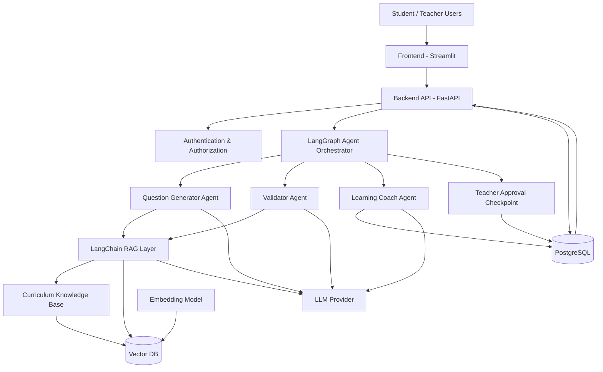
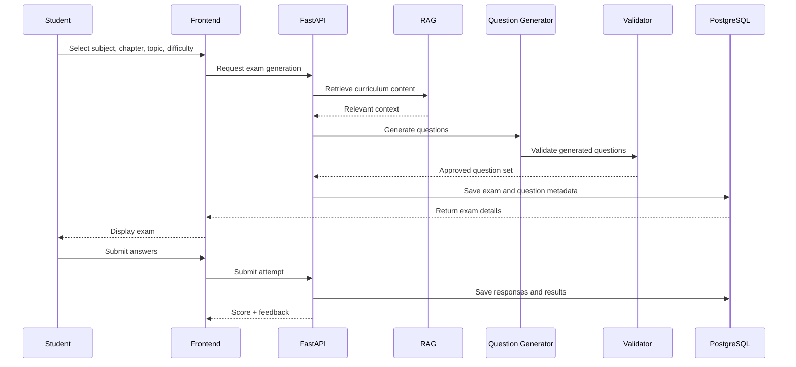
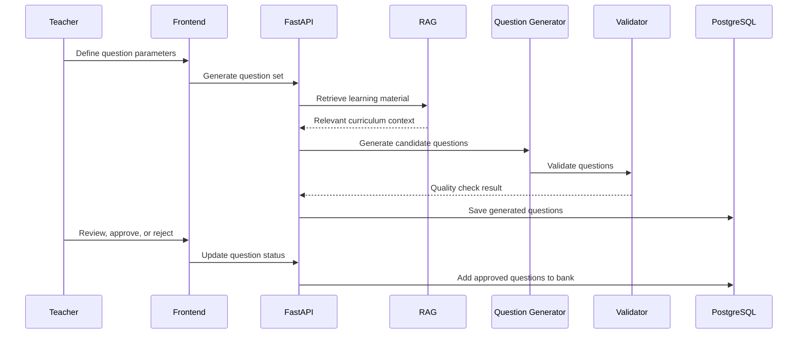
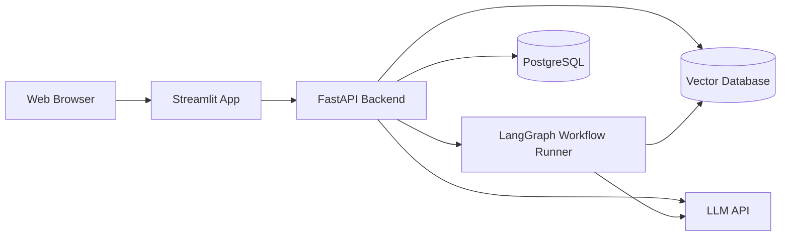

# Capstone Architecture Document

## 1. Introduction

This capstone project delivers an AI-powered personalized learning and examination system for CBSE Class 10 students in Physics and Mathematics. The architecture is designed as a simple but modular MVP that supports student self-learning, teacher review and approval workflows, AI-based question generation, validation, personalization, and performance tracking.

The system is intentionally structured so that the core flow remains easy to build and demonstrate within a short capstone timeline, while still being extensible for future enhancements such as additional subjects, chapters, advanced AI coaching, or broader school-level deployment.

---

## 2. Architectural Goals

The architecture must satisfy the following goals:

- Keep the MVP simple enough for a six-week implementation
- Separate UI, API, AI, and data layers for maintainability
- Support curriculum-grounded question generation through RAG
- Validate generated content before it reaches students or teachers
- Support both student and teacher use cases with role-based access
- Allow future expansion without redesigning the complete system

---

## 3. High-Level Architecture

---

## 4. Architectural Overview

The system follows a layered architecture with clear separation of concerns:

1. Frontend Layer
   - Student interface
   - Teacher interface
   - Dashboard views for progress, results, and practice

2. Application Layer
   - FastAPI backend services
   - Authentication and role-based access
   - Exam, question, student, and teacher APIs
   - LangGraph orchestration entry points for question generation and student coaching flows

3. AI Layer
   - LangChain-based retrieval and prompt orchestration
   - LangGraph workflow states for generation, validation, teacher approval, and personalized practice
   - Question generation agent
   - Question validation agent
   - Learning coach agent
   - RAG retrieval pipeline

4. Data Layer
   - PostgreSQL for persistent relational data
   - Vector database for curriculum retrieval and semantic search

5. External Integration Layer
   - LLM provider for generation and validation
   - Embedding model for vector indexing
   - Educational source documents used as knowledge base

### LangGraph Workflow Role

The project uses LangGraph as the coordination layer for the agentic workflow. Each major flow is modeled as a graph state with transitions such as:

- generate_question_set
- validate_questions
- teacher_review
- approve_or_reject
- update_topic_performance
- recommend_targeted_practice

This keeps the AI logic stateful, readable, and easier to debug than a purely imperative sequence of function calls.

---

## 5. Core Components

### 5.1 Frontend Layer

Technology: Streamlit

Responsibilities:
- Student exam creation and submission
- Teacher question generation and review
- Question bank management
- Student progress dashboard
- Weak-area practice and badges

Design characteristics:
- Simple and fast to build for MVP
- Role-specific views for students and teachers
- Direct connection to backend APIs

---

### 5.2 Backend API Layer

Technology: FastAPI

Responsibilities:
- Handle authentication and access control
- Manage student and teacher APIs
- Create and retrieve questions and exams
- Save attempts, answers, explanations, and scores
- Expose analytics and progress endpoints
- Trigger LangGraph workflows for generation, validation, and coaching

Key modules:
- Auth Service
- User Service
- Question Service
- Exam Service
- Student Performance Service
- Teacher Review Service
- Analytics Service
- Agent Orchestration Service

---

### 5.3 LangChain + LangGraph AI Layer

#### LangChain Responsibilities
- RAG document loading and retrieval
- Embedding integration
- Prompt construction
- LLM API abstraction
- Structured output parsing

#### LangGraph Responsibilities
- Manage workflow state across multiple AI steps
- Coordinate agents in sequence
- Handle retry logic after validation failures
- Support teacher approval checkpoints
- Maintain the learning loop for personalized practice

This makes the project more clearly agentic than a simple function call pipeline and fits the capstone’s “Generate → Validate → Examine → Evaluate → Analyze → Personalize” objective.

---

### 5.4 AI Question Generation Agent

Responsibilities:
- Understand selected subject, chapter, topic, difficulty, and question type
- Retrieve relevant curriculum context using RAG
- Generate structured questions with metadata
- Produce expected answers, explanations, and learning objectives

Input:
- Subject
- Chapter
- Topic
- Difficulty
- Marks
- Question type
- Number of questions

Output:
- Structured question JSON
- Answer key
- Explanation
- Metadata

---

### 5.4 Question Validation Agent

Responsibilities:
- Check curriculum relevance
- Validate correctness of answer and explanation
- Ensure difficulty and question type match the request
- Detect duplicate or low-quality questions
- Confirm learning objective alignment

Validation rules:
- Reject or regenerate invalid questions
- Enforce source-grounded outputs
- Flag questions that do not match syllabus or expected format

This agent is essential for trustworthy AI output and reduces hallucination risk.

---

### 5.5 Learning Coach Agent

Responsibilities:
- Analyze student topic performance
- Identify strong and weak areas
- Recommend improved practice focus
- Suggest difficulty and mix of question types

Example behavior:
- Student scores low in series and parallel circuits
- System recommends targeted practice for that topic
- Learning Coach selects medium difficulty and mixed conceptual/numerical questions

---

### 5.6 LangChain RAG Layer

Responsibilities:
- Parse curriculum documents and educational references
- Chunk, embed, and store content in a vector database
- Retrieve only relevant context for each generation request
- Provide grounded information to the language model
- Support question generation, validation, and personalized coaching prompts

Typical data sources:
- CBSE syllabus and curriculum material
- Public educational references
- Sample papers and curated learning content

This layer is the main mechanism that keeps generated questions aligned with the academic scope. In the project, LangChain handles both retrieval and prompt context assembly, while LangGraph controls the high-level workflow.

---

### 5.7 Data Layer

#### PostgreSQL
Used for structured application data such as:
- Users
- Students
- Teachers
- Subjects
- Chapters
- Topics
- Questions
- Exams
- Student attempts
- Answers
- Results
- Badges
- Topic performance

#### Vector Database
Used for:
- Embeddings of curriculum content
- Semantic retrieval for question generation
- Context retrieval for validation and coaching

---

## 6. System Interaction Flow

### 6.1 Student Flow

### 6.2 Teacher Flow

---

## 7. Deployment and Runtime View

For the MVP, the system can run as a local or containerized application with the following runtime pattern:

This is a lightweight, practical architecture for a capstone prototype and does not require a highly distributed system.

---

## 8. Modularity and Separation of Concerns

The architecture is intentionally modular so each component can evolve independently:

- Frontend can be replaced or expanded without changing core business logic
- Backend APIs can be extended with more endpoints and analytics modules
- AI components can be upgraded with more advanced prompting or validation models
- Database schema can be expanded with new entities as requirements grow
- RAG content sources can be increased beyond the initial chapter set

This keeps the project easy to implement in an MVP while preserving a clean foundation for future work.

---

## 9. MVP Scope and Simplifications

To stay within the capstone timeline, the MVP architecture intentionally limits complexity:

- Only two subjects: Physics and Mathematics
- Selected chapters only for initial rollout
- A single vector store and one main database
- Centralized backend APIs instead of microservices
- Teacher and student roles with basic role-based access
- Simple question validation and personalization logic
- Single LLM provider integration

This reduces implementation risk while still proving the core AI learning loop.

---

## 10. Future Evolution Path

The current architecture can evolve naturally into a richer platform:

### Possible future additions
- Additional subjects such as Chemistry or other boards
- More chapters and richer curriculum data
- More advanced AI agents for adaptive tutoring
- Stronger long-answer evaluation with rubric-based grading
- Expanded analytics and parent/teacher dashboards
- Mobile app interface
- More scalable deployment using cloud services
- Multi-tenant or school-level deployment model

### Architectural evolution strategy
- Add new services behind the same API layer
- Increase curriculum coverage in the vector database
- Replace simple validation rules with more advanced benchmarking
- Add caching and asynchronous job processing for heavy AI workloads
- Introduce container orchestration when scale increases
- Expand LangGraph workflows with additional states and tool nodes as the system becomes more complex

---

## 11. Security and Responsible AI Considerations

The architecture includes basic safeguards aligned with the proposal:

- User authentication for students and teachers
- Role-based access to teacher/admin workflows
- Server-side storage of API keys
- No LLM key exposure in the frontend
- Validation agent for correctness and syllabus adherence
- Teacher approval step before official exam content is finalized
- Structured metadata for source traceability and explainability

---

## 12. Architectural Advantages

This architecture is suitable for the MVP because it provides:

- Clear separation between user interface, business logic, AI, and data storage
- Easy implementation with the recommended stack: Streamlit, FastAPI, PostgreSQL, vector DB, and LLM
- Strong educational value through RAG + validation + personalization loop
- A clean foundation for future learning-system expansion

---

## 13. Summary

The proposed architecture is a simple yet robust MVP design for an AI-powered personalized learning and exam system. It prioritizes curriculum grounding, validation, personalization, and teacher oversight while remaining modular and extensible for future enrichment.

The design aligns closely with the capstone objective:

Generate → Validate → Examine → Evaluate → Analyze → Personalize

This creates a complete learning loop that is easy to demonstrate, easy to evaluate, and ready for future improvement.
