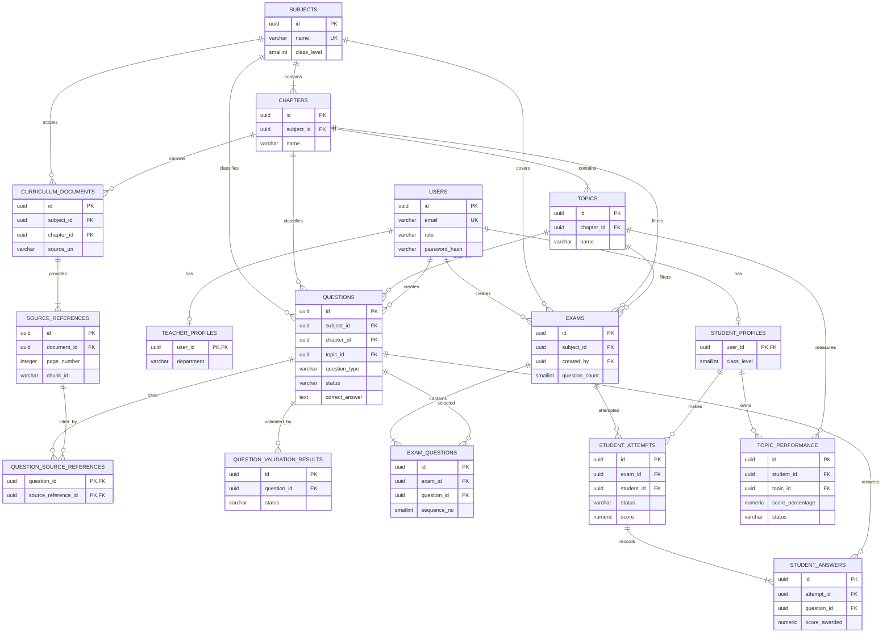

# Capstone Database Design

## 1. Database Design Overview

This design defines the PostgreSQL schema for the AI-powered personalized learning and examination system for CBSE Class 10 Physics and Mathematics. PostgreSQL is the authoritative store for identity, curriculum metadata, generated questions, exams, attempts, answers, validation results, and topic performance. FAISS remains a rebuildable retrieval index and is not represented as relational business data.

The MVP persists the complete student exam path: authenticate, browse seeded curriculum, generate and validate MCQ or numerical questions, create an exam, submit an attempt, calculate results, and update topic performance. The schema also includes explicitly separated extension tables for teacher approval, exam assignments, badges, and coach recommendations required by the broader requirements but deferred by the current API and runbook.

### Scope decisions

- Class level is fixed to `10` by database and API validation for the MVP.
- Initial subjects are Physics and Mathematics.
- Initial chapters are the three Physics and four Mathematics chapters listed in the technical design.
- Question types implemented by the MVP are `mcq` and `numerical`. `short_answer`, `long_answer`, and `competency` are reserved for later evaluation implementations.
- Question validation is persisted independently from question status so every validator check and failure reason can be inspected.
- Submitted attempts are immutable except for operational metadata; repeated submission is idempotent.

## 2. Database Technology

| Concern | Decision |
|---|---|
| Engine | PostgreSQL |
| Version | PostgreSQL 14 or newer; no feature requiring a version newer than 14 is used |
| Relational data | PostgreSQL tables, foreign keys, constraints, `jsonb`, `numeric`, and `timestamptz` |
| Vector data | FAISS files managed by the RAG layer; rebuildable from curated curriculum documents |
| Hosting | Local PostgreSQL for development and tests; PostgreSQL for production, containerized only for cloud deployment |
| Development database | `capstone` |
| Test database | `capstone_test`, isolated from development data |
| ORM | SQLAlchemy 2.x with psycopg2 connection URL |
| Migrations | Alembic; migrations are the schema authority after the initial migration |
| Time zone | UTC; `timestamptz` values are written and returned as UTC ISO 8601 |
| Secrets | Database credentials and application secrets are environment variables, never table data or committed configuration |

The runbook connection format is `postgresql+psycopg2://...`. Unit tests mock LLM calls; integration tests use `capstone_test`.

## 3. Design Principles

1. Keep PostgreSQL normalized around stable business entities and avoid storing FAISS vectors in the relational database.
2. Enforce identity, ownership, valid enumerations, curriculum hierarchy, and score boundaries in the database where practical.
3. Keep API response projections separate from SQLAlchemy models; never expose `password_hash` or answer keys to students before submission.
4. Preserve historical exam meaning by retaining the `exam_questions` relationship and never changing a question used by a submitted attempt.
5. Use UUID primary keys to match the public API contract and avoid exposing sequential record counts.
6. Prefer soft lifecycle/status changes over physical deletion for questions, exams, attempts, and analytics.

## 4. Domain/Data Model

### Core entities

| Entity | Purpose | Ownership |
|---|---|---|
| User | Login identity, role, and account lifecycle | System |
| Student profile | Class-level student data | One user |
| Teacher profile | Teacher-specific data | One user |
| Subject | Extensible academic subject | System seed |
| Chapter | Subject unit | One subject |
| Topic | Chapter-level learning area and analytics unit | One chapter |
| Curriculum document | Curated source document metadata for RAG | System |
| Source reference | Page/chunk-level citation metadata | One document |
| Question | Generated and validated assessment content | One creator and curriculum location |
| Question source reference | Many-to-many question citations | Question/source pair |
| Question validation result | Validator checks and workflow result | One question/run |
| Exam | Ordered assessment definition | One creator |
| Exam question | Exam-to-question junction with stable order | One exam/question pair |
| Student attempt | One student's run through an exam | One student/exam |
| Student answer | Answer and score for one exam question | One attempt/question |
| Topic performance | Current aggregate performance for one student/topic | One student/topic |

### Extension entities

| Entity | Purpose | Current API status |
|---|---|---|
| Exam assignment | Teacher-to-student assignment | Post-MVP endpoint |
| Badge | System-defined achievement | Post-MVP endpoint |
| Student badge | Award event for a student | Post-MVP endpoint |
| Practice recommendation | Persisted learning-coach recommendation | Post-MVP endpoint |

## 5. Entity Definitions

### User and profiles

`users` stores authentication identity and role. Exactly one of `student_profiles` or `teacher_profiles` must exist for an active user; the role/profile match is enforced by service logic because PostgreSQL `CHECK` constraints cannot inspect another table. A student profile stores `class_level = 10` for MVP. Passwords are stored only as Argon2 or bcrypt hashes.

### Curriculum

`subjects -> chapters -> topics` is the extensible academic hierarchy. Names are unique within their parent. `curriculum_documents` stores curated document metadata, not document contents or embeddings. `source_references` identifies the document page/chunk and is linked to questions through `question_source_references`.

### Questions and validation

`questions` stores the generated question, answer data, explanation, educational metadata, and status. `options` is `jsonb` and is required for MCQ questions with exactly four unique keys `A`, `B`, `C`, and `D`; numerical questions must have no options. `question_validation_results` stores all six API validation dimensions and failure reasons. `question_source_references` physically implements the question-to-source many-to-many relationship.

### Exams, attempts, and answers

`exams` stores selection criteria and ownership. `exam_questions` orders questions and prevents duplicates in an exam. `student_attempts` stores status, timestamps, score, maximum score, percentage, and a stable submission result. `student_answers` stores one row per exam question, including unanswered questions as `NULL` submitted answers and zero score. The attempt submission transaction calculates and writes all answers, result fields, and performance aggregates together.

### Analytics and achievements

`topic_performance` is a current aggregate, not a replacement for attempt history. Its counters are updated once per submitted attempt. Badges and recommendations are separate so adding gamification or coaching does not pollute exam scoring tables.

## 6. Table Specifications

### 6.1 `users`

| Column | Data Type | Nullable | Default | Key/Constraint | Description |
|---|---|---:|---|---|---|
| `id` | `uuid` | No | `gen_random_uuid()` | PK | Public user identifier |
| `email` | `varchar(320)` | No | None | Unique | Normalized lowercase login email |
| `password_hash` | `varchar(255)` | No | None | None | Argon2/bcrypt hash; never returned |
| `full_name` | `varchar(200)` | No | None | None | Display name |
| `role` | `varchar(20)` | No | None | Check | `student` or `teacher` |
| `is_active` | `boolean` | No | `true` | Check | Account lifecycle flag |
| `created_at` | `timestamptz` | No | `now()` | None | Creation time in UTC |
| `updated_at` | `timestamptz` | No | `now()` | None | Last account update |

Primary key: `users_pkey (id)`. Unique constraint: `uq_users_email (email)`. Email is normalized before insert and update. User deletion is restricted when dependent business data exists; deactivate instead.

### 6.2 `student_profiles`

| Column | Data Type | Nullable | Default | Key/Constraint | Description |
|---|---|---:|---|---|---|
| `user_id` | `uuid` | No | None | PK, FK `users.id` | Student identity |
| `class_level` | `smallint` | No | `10` | Check `= 10` | MVP class |
| `created_at` | `timestamptz` | No | `now()` | None | Profile creation |
| `updated_at` | `timestamptz` | No | `now()` | None | Last profile update |

The one-to-one primary key is also the foreign key. Deleting a user cascades to an unreferenced profile, but deletion of a user with attempts is restricted.

### 6.3 `teacher_profiles`

| Column | Data Type | Nullable | Default | Key/Constraint | Description |
|---|---|---:|---|---|---|
| `user_id` | `uuid` | No | None | PK, FK `users.id` | Teacher identity |
| `department` | `varchar(150)` | Yes | `NULL` | None | Optional subject/department label |
| `created_at` | `timestamptz` | No | `now()` | None | Profile creation |
| `updated_at` | `timestamptz` | No | `now()` | None | Last profile update |

### 6.4 `subjects`

| Column | Data Type | Nullable | Default | Key/Constraint | Description |
|---|---|---:|---|---|---|
| `id` | `uuid` | No | `gen_random_uuid()` | PK | Subject identifier |
| `name` | `varchar(100)` | No | None | Unique | Subject name |
| `class_level` | `smallint` | No | `10` | Check `= 10` | Supported class |
| `is_active` | `boolean` | No | `true` | None | Curriculum availability |
| `created_at` | `timestamptz` | No | `now()` | None | Creation time |
| `updated_at` | `timestamptz` | No | `now()` | None | Last update |

### 6.5 `chapters`

| Column | Data Type | Nullable | Default | Key/Constraint | Description |
|---|---|---:|---|---|---|
| `id` | `uuid` | No | `gen_random_uuid()` | PK | Chapter identifier |
| `subject_id` | `uuid` | No | None | FK `subjects.id` | Parent subject |
| `name` | `varchar(150)` | No | None | Unique per subject | Chapter name |
| `display_order` | `smallint` | No | None | Check `> 0` | UI ordering |
| `is_active` | `boolean` | No | `true` | None | Curriculum availability |
| `created_at` | `timestamptz` | No | `now()` | None | Creation time |
| `updated_at` | `timestamptz` | No | `now()` | None | Last update |

### 6.6 `topics`

| Column | Data Type | Nullable | Default | Key/Constraint | Description |
|---|---|---:|---|---|---|
| `id` | `uuid` | No | `gen_random_uuid()` | PK | Topic identifier |
| `chapter_id` | `uuid` | No | None | FK `chapters.id` | Parent chapter |
| `name` | `varchar(150)` | No | None | Unique per chapter | Topic name |
| `display_order` | `smallint` | No | None | Check `> 0` | UI ordering |
| `is_active` | `boolean` | No | `true` | None | Curriculum availability |
| `created_at` | `timestamptz` | No | `now()` | None | Creation time |
| `updated_at` | `timestamptz` | No | `now()` | None | Last update |

### 6.7 `curriculum_documents`

| Column | Data Type | Nullable | Default | Key/Constraint | Description |
|---|---|---:|---|---|---|
| `id` | `uuid` | No | `gen_random_uuid()` | PK | Source document identifier |
| `subject_id` | `uuid` | No | None | FK `subjects.id` | Document subject |
| `chapter_id` | `uuid` | Yes | `NULL` | FK `chapters.id` | Optional chapter scope |
| `title` | `varchar(300)` | No | None | None | Human-readable title |
| `source_uri` | `varchar(2048)` | No | None | Unique | Approved source location or local logical path |
| `content_hash` | `char(64)` | No | None | Unique | SHA-256 for ingestion idempotency |
| `document_type` | `varchar(30)` | No | None | Check | `syllabus`, `reference`, or `sample_paper` |
| `is_active` | `boolean` | No | `true` | None | Retrieval eligibility |
| `created_at` | `timestamptz` | No | `now()` | None | Ingestion metadata |
| `updated_at` | `timestamptz` | No | `now()` | None | Last metadata update |

`chapter_id`, when present, must belong to `subject_id`; this cross-table hierarchy check is application-enforced because a simple foreign key cannot express it.

### 6.8 `source_references`

| Column | Data Type | Nullable | Default | Key/Constraint | Description |
|---|---|---:|---|---|---|
| `id` | `uuid` | No | `gen_random_uuid()` | PK | Citation identifier |
| `document_id` | `uuid` | No | None | FK `curriculum_documents.id` | Parent document |
| `page_number` | `integer` | Yes | `NULL` | Check `> 0` when set | Source page |
| `chunk_id` | `varchar(200)` | Yes | `NULL` | None | FAISS ingestion chunk identifier |
| `excerpt` | `text` | Yes | `NULL` | None | Short citation excerpt, not required for retrieval |
| `created_at` | `timestamptz` | No | `now()` | None | Creation time |

Unique constraint: `(document_id, page_number, chunk_id)`. At least one of `page_number` or `chunk_id` is required by an application validation rule.

### 6.9 `questions`

| Column | Data Type | Nullable | Default | Key/Constraint | Description |
|---|---|---:|---|---|---|
| `id` | `uuid` | No | `gen_random_uuid()` | PK | Question identifier |
| `subject_id` | `uuid` | No | None | FK `subjects.id` | Subject metadata |
| `chapter_id` | `uuid` | No | None | FK `chapters.id` | Chapter metadata |
| `topic_id` | `uuid` | Yes | `NULL` | FK `topics.id` | Optional topic scope |
| `class_level` | `smallint` | No | `10` | Check `= 10` | Class level |
| `question_type` | `varchar(30)` | No | None | Check | MVP `mcq` or `numerical`; reserved extension values documented below |
| `difficulty` | `varchar(20)` | No | None | Check | `easy`, `medium`, or `hard` |
| `bloom_level` | `varchar(20)` | Yes | `NULL` | Check | `remember`, `understand`, `apply`, or `analyze` |
| `marks` | `smallint` | No | None | Check `> 0` | Maximum marks |
| `question_text` | `text` | No | None | None | Prompt shown to a student |
| `options` | `jsonb` | Yes | `NULL` | Type check | Four keyed options for MCQ |
| `correct_answer` | `text` | No | None | None | Scoring answer; protected in API projections |
| `expected_answer` | `text` | No | None | None | Display/evaluation answer |
| `explanation` | `text` | No | None | None | Learning feedback |
| `learning_objective` | `text` | No | None | None | Intended learning outcome |
| `status` | `varchar(20)` | No | `generated` | Check | `generated`, `validated`, `rejected`, or reserved `approved` |
| `created_by` | `uuid` | No | None | FK `users.id` | Generator/creator |
| `created_at` | `timestamptz` | No | `now()` | None | Creation time |
| `updated_at` | `timestamptz` | No | `now()` | None | Last status/content update |

Question hierarchy consistency (`chapter` belongs to `subject`; `topic` belongs to `chapter`) is validated in the service transaction. MVP API behavior allows only `generated`, `validated`, and `rejected`; `approved` is reserved for the post-MVP teacher checkpoint. State transitions are `generated -> validated|rejected`, `rejected -> generated|validated` on revalidation, and future `validated -> approved`.

### 6.10 `question_source_references`

| Column | Data Type | Nullable | Default | Key/Constraint | Description |
|---|---|---:|---|---|---|
| `question_id` | `uuid` | No | None | PK/FK `questions.id` | Question |
| `source_reference_id` | `uuid` | No | None | PK/FK `source_references.id` | Citation |
| `relevance_score` | `numeric(6,5)` | Yes | `NULL` | Check `0 <= value <= 1` | Optional retrieval similarity |
| `created_at` | `timestamptz` | No | `now()` | None | Link creation |

Composite primary key prevents duplicate citations. Deleting a question or source reference cascades to this junction row.

### 6.11 `question_validation_results`

| Column | Data Type | Nullable | Default | Key/Constraint | Description |
|---|---|---:|---|---|---|
| `id` | `uuid` | No | `gen_random_uuid()` | PK | Validation run identifier |
| `question_id` | `uuid` | No | None | FK `questions.id` | Validated question |
| `workflow_run_id` | `varchar(200)` | Yes | `NULL` | Index | LangGraph run identifier |
| `status` | `varchar(20)` | No | None | Check | `validated` or `rejected` |
| `curriculum_relevance` | `boolean` | No | None | None | Check result |
| `answer_correctness` | `boolean` | No | None | None | Check result |
| `difficulty_match` | `boolean` | No | None | None | Check result |
| `type_match` | `boolean` | No | None | None | Check result |
| `duplicate_check` | `boolean` | No | None | None | True means no duplicate found |
| `learning_objective_alignment` | `boolean` | No | None | None | Check result |
| `failure_reasons` | `jsonb` | No | `'[]'` | JSON array | Structured reasons |
| `created_at` | `timestamptz` | No | `now()` | None | Validation time |

`status = validated` requires all six booleans true; `status = rejected` requires at least one false. This is enforced in the application and additionally checked in a PostgreSQL constraint using the boolean expression.

### 6.12 `exams`

| Column | Data Type | Nullable | Default | Key/Constraint | Description |
|---|---|---:|---|---|---|
| `id` | `uuid` | No | `gen_random_uuid()` | PK | Exam identifier |
| `title` | `varchar(200)` | No | None | None | Display title |
| `subject_id` | `uuid` | No | None | FK `subjects.id` | Exam subject |
| `chapter_id` | `uuid` | Yes | `NULL` | FK `chapters.id` | Optional chapter filter |
| `topic_id` | `uuid` | Yes | `NULL` | FK `topics.id` | Optional topic filter |
| `difficulty` | `varchar(20)` | No | None | Check | Requested difficulty |
| `question_types` | `jsonb` | No | None | JSON array | Unique requested values, MVP `mcq`/`numerical` |
| `question_count` | `smallint` | No | None | Check `1..50` | Requested/actual count |
| `time_limit_minutes` | `smallint` | No | None | Check `1..180` | Time limit |
| `created_by` | `uuid` | No | None | FK `users.id` | Student or teacher owner |
| `created_at` | `timestamptz` | No | `now()` | None | Creation time |
| `updated_at` | `timestamptz` | No | `now()` | None | Last update |

The exam stores criteria for reporting; its question set is authoritative in `exam_questions`. A question must be `validated` (or future `approved`) when selected. Exam deletion is restricted once an attempt exists.

### 6.13 `exam_questions`

| Column | Data Type | Nullable | Default | Key/Constraint | Description |
|---|---|---:|---|---|---|
| `id` | `uuid` | No | `gen_random_uuid()` | PK | Junction row identifier |
| `exam_id` | `uuid` | No | None | FK `exams.id` | Exam |
| `question_id` | `uuid` | No | None | FK `questions.id` | Selected question |
| `sequence_no` | `smallint` | No | None | Unique per exam, `> 0` | Presentation order |
| `created_at` | `timestamptz` | No | `now()` | None | Selection time |

Unique constraints: `(exam_id, question_id)` and `(exam_id, sequence_no)`. Deleting an unattempted exam cascades; once an attempt exists, deletion is restricted by the attempt relationship.

### 6.14 `student_attempts`

| Column | Data Type | Nullable | Default | Key/Constraint | Description |
|---|---|---:|---|---|---|
| `id` | `uuid` | No | `gen_random_uuid()` | PK | Attempt identifier |
| `exam_id` | `uuid` | No | None | FK `exams.id` | Exam being attempted |
| `student_id` | `uuid` | No | None | FK `student_profiles.user_id` | Attempt owner |
| `status` | `varchar(20)` | No | `in_progress` | Check | `in_progress` or `submitted` |
| `started_at` | `timestamptz` | No | `now()` | None | Start time |
| `submitted_at` | `timestamptz` | Yes | `NULL` | Check | Submission time |
| `score` | `numeric(8,2)` | Yes | `NULL` | Check `>= 0` | Awarded score |
| `max_score` | `smallint` | No | None | Check `> 0` | Sum of exam question marks |
| `percentage` | `numeric(6,2)` | Yes | `NULL` | Check `0..100` | Rounded percentage |
| `created_at` | `timestamptz` | No | `now()` | None | Creation time |
| `updated_at` | `timestamptz` | No | `now()` | None | Last state update |

Unique partial index: one active (`in_progress`) attempt per `(exam_id, student_id)`. A submitted attempt requires `submitted_at`, `score`, and `percentage`; an in-progress attempt must have those result fields null. The service locks the attempt row during submission.

### 6.15 `student_answers`

| Column | Data Type | Nullable | Default | Key/Constraint | Description |
|---|---|---:|---|---|---|
| `id` | `uuid` | No | `gen_random_uuid()` | PK | Answer identifier |
| `attempt_id` | `uuid` | No | None | FK `student_attempts.id` | Attempt |
| `question_id` | `uuid` | No | None | FK `questions.id` | Answered exam question |
| `submitted_answer` | `varchar(4000)` | Yes | `NULL` | Empty disallowed when non-null | Student answer; null means unanswered |
| `is_correct` | `boolean` | No | `false` | None | Scoring result |
| `score_awarded` | `numeric(8,2)` | No | `0` | Check `>= 0` | Marks awarded |
| `max_score` | `smallint` | No | None | Check `> 0` | Question marks snapshot |
| `created_at` | `timestamptz` | No | `now()` | None | Answer creation |
| `updated_at` | `timestamptz` | No | `now()` | None | Evaluation update |

Unique constraint: `(attempt_id, question_id)`. The service verifies that `question_id` is in the attempt's exam. Answers are inserted for all exam questions at submission, including missing answers.

### 6.16 `topic_performance`

| Column | Data Type | Nullable | Default | Key/Constraint | Description |
|---|---|---:|---|---|---|
| `id` | `uuid` | No | `gen_random_uuid()` | PK | Aggregate identifier |
| `student_id` | `uuid` | No | None | FK `student_profiles.user_id` | Student |
| `topic_id` | `uuid` | No | None | FK `topics.id` | Topic |
| `attempts` | `integer` | No | `0` | Check `>= 0` | Attempt count containing topic |
| `correct_answers` | `integer` | No | `0` | Check `>= 0` | Correct answer count |
| `score_earned` | `numeric(12,2)` | No | `0` | Check `>= 0` | Marks earned |
| `score_possible` | `numeric(12,2)` | No | `0` | Check `>= 0` | Marks possible |
| `score_percentage` | `numeric(6,2)` | No | `0` | Check `0..100` | Aggregate percentage |
| `status` | `varchar(20)` | No | `needs_practice` | Check | `strong`, `good`, or `needs_practice` |
| `last_updated` | `timestamptz` | No | `now()` | None | Analytics update time |
| `created_at` | `timestamptz` | No | `now()` | None | First aggregate creation |

Unique constraint: `(student_id, topic_id)`. `score_percentage` and `status` are derived by the analytics service from aggregate counters; database checks prevent invalid stored values.

### 6.17 Extension tables

`exam_assignments`:

| Column | Data Type | Nullable | Default | Key/Constraint | Description |
|---|---|---:|---|---|---|
| `id` | `uuid` | No | `gen_random_uuid()` | PK | Assignment identifier |
| `exam_id` | `uuid` | No | None | FK `exams.id` | Assigned exam |
| `student_id` | `uuid` | No | None | FK `student_profiles.user_id` | Assigned student |
| `assigned_by` | `uuid` | No | None | FK `teacher_profiles.user_id` | Assigning teacher |
| `status` | `varchar(20)` | No | `assigned` | Check | `assigned`, `started`, `completed`, or `expired` |
| `assigned_at` | `timestamptz` | No | `now()` | None | Assignment time |
| `completed_at` | `timestamptz` | Yes | `NULL` | Check | Completion time |

Primary key: `id`. Unique `(exam_id, student_id)` prevents duplicate assignments. `completed_at` is required when status is `completed` and null for `assigned`/`started`; this is service- and check-enforced.

`badges`:

| Column | Data Type | Nullable | Default | Key/Constraint | Description |
|---|---|---:|---|---|---|
| `id` | `uuid` | No | `gen_random_uuid()` | PK | Badge identifier |
| `code` | `varchar(80)` | No | None | Unique | Stable system code |
| `name` | `varchar(120)` | No | None | None | Display name |
| `description` | `text` | No | None | None | Achievement description |
| `points` | `integer` | No | `0` | Check `>= 0` | Points awarded |
| `is_active` | `boolean` | No | `true` | None | Whether it can be awarded |

`student_badges`:

| Column | Data Type | Nullable | Default | Key/Constraint | Description |
|---|---|---:|---|---|---|
| `student_id` | `uuid` | No | None | PK/FK `student_profiles.user_id` | Student recipient |
| `badge_id` | `uuid` | No | None | PK/FK `badges.id` | Badge definition |
| `earned_at` | `timestamptz` | No | `now()` | PK component | Award time |

Composite primary key: `(student_id, badge_id)`; duplicate awards are prevented. Deletes are restricted to preserve achievement history.

`practice_recommendations`:

| Column | Data Type | Nullable | Default | Key/Constraint | Description |
|---|---|---:|---|---|---|
| `id` | `uuid` | No | `gen_random_uuid()` | PK | Recommendation identifier |
| `student_id` | `uuid` | No | None | FK `student_profiles.user_id` | Recommendation owner |
| `topic_id` | `uuid` | Yes | `NULL` | FK `topics.id` | Focus topic |
| `question_count` | `smallint` | No | None | Check `1..50` | Recommended count |
| `difficulty` | `varchar(20)` | No | None | Check | `easy`, `medium`, or `hard` |
| `question_types` | `jsonb` | No | None | JSON array | Recommended type mix |
| `status` | `varchar(20)` | No | `recommended` | Check | `recommended`, `accepted`, `completed`, or `dismissed` |
| `created_at` | `timestamptz` | No | `now()` | None | Recommendation time |
| `completed_at` | `timestamptz` | Yes | `NULL` | None | Completion time |

Foreign-key deletes are restricted for students and set `topic_id` null if a topic is retired. The recommendation status and JSON-array shape are database-checked; coach workflow transitions are service-enforced.

These extension tables use the same UUID, timestamp, foreign-key, and delete conventions as the MVP tables and are excluded from current MVP API writes.

## 7. Relationships

| Parent | Child | Cardinality/optionality | Foreign key | Delete behavior | Update behavior |
|---|---|---|---|---|---|
| `users` | `student_profiles` | 1 to 0..1 | `student_profiles.user_id` | Cascade only before business references; otherwise restrict/deactivate | Cascade key update |
| `users` | `teacher_profiles` | 1 to 0..1 | `teacher_profiles.user_id` | Same as student profile | Cascade key update |
| `subjects` | `chapters` | 1 to many; chapter required | `chapters.subject_id` | Restrict if questions/documents exist | Cascade key update |
| `chapters` | `topics` | 1 to many; topic required | `topics.chapter_id` | Restrict if questions/performance exist | Cascade key update |
| `subjects` | `curriculum_documents` | 1 to many | `curriculum_documents.subject_id` | Restrict; deactivate instead | Cascade key update |
| `chapters` | `curriculum_documents` | 1 to many optional | `curriculum_documents.chapter_id` | Set null only for document scope | Cascade key update |
| `curriculum_documents` | `source_references` | 1 to many | `source_references.document_id` | Cascade | Cascade key update |
| `subjects` | `questions` | 1 to many | `questions.subject_id` | Restrict | Cascade key update |
| `chapters` | `questions` | 1 to many | `questions.chapter_id` | Restrict | Cascade key update |
| `topics` | `questions` | 1 to many optional | `questions.topic_id` | Set null only for non-topic questions; MVP service normally restricts | Cascade key update |
| `users` | `questions` | 1 to many creators | `questions.created_by` | Restrict | Cascade key update |
| `questions` | `question_source_references` | 1 to many | `question_id` | Cascade | Cascade key update |
| `source_references` | `question_source_references` | 1 to many | `source_reference_id` | Cascade | Cascade key update |
| `questions` | `question_validation_results` | 1 to many | `question_id` | Cascade | Cascade key update |
| `users` | `exams` | 1 to many owners | `exams.created_by` | Restrict after attempts | Cascade key update |
| `subjects`/`chapters`/`topics` | `exams` | subject required; narrower filters optional | corresponding FKs | Restrict | Cascade key update |
| `exams` | `exam_questions` | 1 to many | `exam_id` | Cascade before attempts; restrict after attempts | Cascade key update |
| `questions` | `exam_questions` | 1 to many | `question_id` | Restrict if selected | Cascade key update |
| `exams` | `student_attempts` | 1 to many | `exam_id` | Restrict | Cascade key update |
| `student_profiles` | `student_attempts` | 1 to many | `student_id` | Restrict | Cascade key update |
| `student_attempts` | `student_answers` | 1 to many | `attempt_id` | Cascade only while deleting an invalid attempt | Cascade key update |
| `questions` | `student_answers` | 1 to many | `question_id` | Restrict for history | Cascade key update |
| `student_profiles` | `topic_performance` | 1 to many | `student_id` | Restrict; retain analytics history | Cascade key update |
| `topics` | `topic_performance` | 1 to many | `topic_id` | Restrict | Cascade key update |

The question/source and exam/question relationships are many-to-many relationships implemented by `question_source_references` and `exam_questions` respectively. `student_answers` is also an associative fact table between attempts and questions, with scoring attributes.

## 8. Entity Relationship Diagram



## 9. API-to-Database Mapping

### Resource mapping

| API resource/operation | Tables | CRUD | Primary lookup/key fields | Validation and transaction |
|---|---|---|---|---|
| `POST /auth/register` | `users`, one profile table | Create | `users.email` | Normalize unique email; role/profile and class-level transaction |
| `POST /auth/login` | `users` | Read | normalized email | Compare hash; never write credentials |
| `POST /auth/logout` | None | None | JWT client disposal | No token blacklist in MVP |
| `GET /auth/me` | `users`, profile | Read | authenticated `users.id` | Ownership is token-derived |
| `GET /curriculum/subjects` | `subjects` | Read | active/class 10 | Paginate and order by name |
| `GET /curriculum/subjects/{id}/chapters` | `chapters` | Read | `subject_id` | Confirm parent subject; active only |
| `GET /curriculum/chapters/{id}/topics` | `topics` | Read | `chapter_id` | Confirm parent chapter; active only |
| `POST /questions/generate` | `questions`, `question_validation_results`, `source_references`, junction | Create | `questions.id`, workflow run | Generate, validate, and save each result atomically; no partial exam |
| `GET /questions` | `questions` | Read | filters on subject/chapter/topic/type/difficulty/status | Students see validated exam-visible data; teachers see authorized records |
| `GET /questions/{id}` | `questions`, sources, validation | Read | `questions.id` | Hide `correct_answer` from student projections |
| `GET /questions/{id}/validation` | `question_validation_results` | Read | `question_id` | Teacher-only |
| `POST /questions/{id}/revalidate` | `questions`, validation, source junction | Update/Create | `question_id` | Only generated/rejected; update status and append validation result in transaction |
| `POST /exams/generate` | `exams`, `exam_questions`, `questions` | Create/Read | `exams.id` | Parent hierarchy and validated-question count; transaction locks/selects slots |
| `GET /exams/{id}` | `exams`, `exam_questions`, `questions` | Read | `exams.id` | Owner/teacher authorization; answer-key-safe projection |
| `GET /exams` | `exams` | Read | owner/filter/page | Ownership and pagination |
| `POST /exams/{id}/attempts` | `student_attempts` | Create/Read | `(exam_id, student_id)` | Partial unique active-attempt rule; retry returns existing row |
| `GET /attempts/{id}` | attempt, exam questions, answers | Read | `student_attempts.id` | Owner or authorized teacher; key hidden while active |
| `POST /attempts/{id}/submit` | attempts, answers, topic performance | Update/Create | `attempt_id` | One transaction; row lock; exact MCQ or ±5% numerical scoring; idempotent repeat |
| `GET /students/me/progress` | `topic_performance`, `topics` | Read | `(student_id, topic/topic filters)` | Paginated aggregate |
| `GET /students/me/weak-topics` | `topic_performance`, `topics` | Read | student and `status = needs_practice` | Order by percentage then oldest update |
| `GET /students/me/attempts` | `student_attempts`, `exams` | Read | student/status/date range | Paginated, owner scoped |
| `GET /teachers/me/dashboard` | `questions`, `exams` | Read/aggregate | `created_by` | Teacher-owned counts; no cross-student analytics |

### Field transformations and derived values

- API `id` fields map directly to UUID primary keys.
- `QuestionOption[]` maps to `questions.options` JSONB; API validates keys and text before persistence.
- `source_references` is assembled from `source_references` through `question_source_references` and is not a single question column.
- `QuestionResponse.status` maps to `questions.status`; `approved` is not exposed until the post-MVP approval API exists.
- `AttemptResultResponse.score`, `max_score`, and `percentage` map to attempt columns; answer-level results map to `student_answers` plus question answer data in an authorized projection.
- `weak_topics` is derived by joining `topic_performance` to `topics` and filtering `needs_practice`.
- Pagination `page`, `page_size`, `total`, and `has_next` are calculated metadata, not persisted fields.
- JWT access tokens, logout state, prompts, raw LLM output, FAISS vectors, and API keys are not persisted here.

### Post-MVP API support

Approval, teacher assignments, practice recommendations, badges, and teacher/student analytics use `exam_assignments`, `practice_recommendations`, `badges`, `student_badges`, and existing performance tables. Their current absence from the MVP endpoint set is an intentional API scope decision, not an orphaned table.

## 10. Requirements-to-Database Traceability

| Requirement ID | Requirement summary | Table(s) | Relevant fields | Supporting constraint/logic |
|---|---|---|---|---|
| FR-MH-01 | Student chooses exam parameters | `subjects`, `chapters`, `topics`, `exams` | subject/chapter/topic, difficulty, types, count, time limit | hierarchy FKs; count 1..50; duration 1..180 |
| FR-MH-02 | Personalized exam generation | `exams`, `exam_questions`, `questions` | criteria, ordered selection | validated-question selection transaction |
| FR-MH-03 | Multiple types and scoring | `questions`, `student_answers` | type, marks, answer, score | MVP type/status checks; score bounds |
| FR-MH-04 | Evaluation and explanations | `student_attempts`, `student_answers`, `questions` | score, percentage, explanation | atomic submission; answer-key access control |
| FR-MH-05 | Weak-area detection | `topic_performance` | percentage, status, counters | thresholds: strong >=80, good >=60, needs <60 |
| FR-MH-06 | Targeted practice | `topic_performance`, `practice_recommendations` | weak topic and recommendation parameters | extension table supports post-MVP coach flow |
| FR-MH-07 | Teacher generates questions | `users`, `questions` | creator and metadata | teacher authorization and creator FK |
| FR-MH-08 | Review/approve question bank | `questions`, `question_validation_results` | status and validation checks | approved reserved state; current API uses validated |
| FR-MH-09 | Curriculum-grounded retrieval | `curriculum_documents`, `source_references`, junction | source URI, hash, page/chunk | citation required for generated questions by service |
| FR-MH-10 | Validation agent | `question_validation_results` | six boolean checks, reasons, workflow run | status/check consistency constraint |
| FR-MH-11 | Core structured data | all core tables | entity columns | PK/FK/unique constraints |
| FR-MH-12 | Stateful workflow | questions, validation results | workflow run ID, status | generation/revalidation state transitions |
| FR-MH-13 | Backend API integration | all API tables | resource keys | CRUD mappings and ownership logic |
| FR-SH-01 | Coach recommendations | `practice_recommendations`, `topic_performance` | focus, difficulty, mix | extension-ready status and FK rules |
| FR-SH-02 | Progress trends | `student_attempts`, `student_answers`, `topic_performance` | historical attempts and aggregate | submitted attempt history retained |
| FR-SH-03 | Points/badges | `badges`, `student_badges` | code, points, earned time | unique award per badge/student |
| FR-SH-04 | Teacher assignments | `exam_assignments` | exam, student, assigned_by | unique assignment and lifecycle checks |
| FR-SH-05 | Dashboard outcomes | `exams`, `student_attempts`, `topic_performance` | scores and ownership | indexed teacher and student reporting |
| FR-CH-01 | Extensible subjects/chapters | `subjects`, `chapters`, `topics` | active hierarchy | no hard-coded table redesign required |
| FR-CH-02 | Long-form evaluation | `questions`, `student_answers` | reserved type, answer, feedback extension | type reserved; evaluation logic not MVP |
| FR-CH-03 | Advanced personalization | `topic_performance`, recommendations | aggregates and recommendation history | extension boundary |
| NFR-MH-01 | Secure role separation | `users`, profiles | role, active flag | service authorization plus profile FKs |
| NFR-MH-02 | Confidential records | users, attempts, answers, performance | identity/results | ownership queries; hashes only |
| NFR-MH-03 | Curriculum accuracy | questions, sources, validation | source links and checks | validation result required before exam use |
| NFR-SH-03 | Persistence and recovery | all PostgreSQL tables | durable relational records | backups and migrations |
| NFR-MH-04 | Maintainability/extensibility | hierarchy and normalized modules | stable FKs/statuses | Alembic migrations |
| NFR-CH-01 | Growth | indexed core tables | UUIDs and indexes | pagination and selective indexes |

The broader proposal's FR-MH-08 teacher approval and FR-SH-04 assignment flows are not current MVP API operations. Their data structures are included because they are explicit requirements; the implementation checklist marks their endpoints as deferred.

## 11. Data Integrity and Validation

### Database-enforced

- Primary keys, foreign keys, composite keys, and unique constraints.
- Lowercase email uniqueness, non-null identity fields, positive marks/counts/durations.
- Enumerated values for role, difficulty, status, question type, Bloom level, document type, and analytics status.
- Class level equals `10` for MVP users' student profiles and subjects.
- Score, percentage, relevance, and counter numeric bounds.
- One active attempt per student/exam; one answer per attempt/question; one question sequence per exam.
- Submitted attempt consistency: result fields exist only with `submitted` status.
- MCQ option shape and numerical option absence through constraints where feasible.
- Validation status consistency with all six validator checks.

### Application/API-enforced

- Argon2/bcrypt password policy and password verification.
- User role/profile one-of relationship and teacher registration restrictions.
- Cross-table subject/chapter/topic hierarchy validation.
- Ownership and role authorization.
- Question source citation existence and source/document scope.
- Question type availability and reserved-type rejection.
- Numerical parsing, compatible units, and ±5% comparison.
- Submission time-limit check and idempotent response handling.
- Prohibition on changing questions or scoring inputs after an exam has a submitted attempt.
- API pagination and Pydantic string lengths, UUID shape, and request envelopes.

## 12. Indexing Strategy

PostgreSQL automatically indexes primary keys and unique constraints. The following additional indexes support documented access patterns:

| Table | Index name | Columns | Type | Purpose |
|---|---|---|---|---|
| `users` | `ix_users_role_active` | `(role, is_active)` | B-tree | Role authorization and active-user queries |
| `chapters` | `ix_chapters_subject_order` | `(subject_id, is_active, display_order)` | B-tree | Curriculum chapter listing |
| `topics` | `ix_topics_chapter_order` | `(chapter_id, is_active, display_order)` | B-tree | Curriculum topic listing |
| `questions` | `ix_questions_topic_status` | `(topic_id, status)` | B-tree | Validated topic question selection |
| `questions` | `ix_questions_filter` | `(subject_id, chapter_id, question_type, difficulty, status)` | B-tree | Teacher question filters and exam matching |
| `questions` | `ix_questions_creator_status` | `(created_by, status, created_at DESC)` | B-tree | Teacher review/dashboard lists |
| `question_validation_results` | `ix_qvr_question_created` | `(question_id, created_at DESC)` | B-tree | Latest validation lookup |
| `question_validation_results` | `ix_qvr_workflow_run` | `(workflow_run_id)` | B-tree | Workflow diagnosis |
| `exams` | `ix_exams_creator_created` | `(created_by, created_at DESC)` | B-tree | Owner exam list |
| `exams` | `ix_exams_subject_created` | `(subject_id, created_at DESC)` | B-tree | Subject-filtered exam list |
| `exam_questions` | `ix_exam_questions_question` | `(question_id)` | B-tree | Reverse question usage lookup |
| `student_attempts` | `ix_attempts_student_status_date` | `(student_id, status, created_at DESC)` | B-tree | Student attempts and status/date filters |
| `student_attempts` | `ix_attempts_exam` | `(exam_id, created_at DESC)` | B-tree | Exam results and active-attempt checks |
| `student_answers` | `ix_answers_question` | `(question_id)` | B-tree | Question performance aggregation |
| `topic_performance` | `ix_performance_student_status_score` | `(student_id, status, score_percentage, last_updated)` | B-tree | Weak topics ordered by score and age |
| `curriculum_documents` | `ix_documents_subject_chapter_active` | `(subject_id, chapter_id, is_active)` | B-tree | Source ingestion and scope filtering |

No index is added to every boolean or JSON field by default. Collection endpoints must use indexed filters and pagination; indexes should be reviewed with `EXPLAIN ANALYZE` after representative data exists.

## 13. Transaction and Concurrency Considerations

### Transaction boundaries

1. Registration inserts `users` and exactly one role profile in one transaction.
2. Question generation inserts questions, source junctions, and validation results in one workflow transaction. Provider failure rolls back the generated set.
3. Exam generation inserts the exam and all ordered `exam_questions` in one transaction. Candidate selection is performed with sufficient row locking to avoid conflicting selections where needed.
4. Starting an attempt inserts one `student_attempts` row. The partial unique index makes concurrent starts converge on one active attempt; a uniqueness error is retried as a read.
5. Submission locks the attempt row (`SELECT ... FOR UPDATE`), verifies status/time limit, inserts all answers, calculates the result, updates the attempt, and upserts topic performance in one transaction.

### Race and idempotency rules

- A second submit sees `submitted` under the row lock and returns the stored result without adding answers or performance counts.
- The database unique key prevents duplicate answers and duplicate exam questions.
- Question content and marks used by a submitted exam are immutable at the service layer; create a new question instead of mutating historical scoring data.
- `workflow_run_id` is retained for diagnosis; external provider retries must be handled by the workflow service before database commit.
- PostgreSQL default `READ COMMITTED` is sufficient for the MVP. Row locks are required for attempt submission and any counter update based on a prior read.

## 14. Audit and History

All core tables include `created_at`; mutable records include `updated_at`. The database does not add `created_by`/`updated_by` to every curriculum or analytics row because the source documents do not require a full audit trail. Questions retain `created_by`, validation results retain `workflow_run_id`, exams retain `created_by`, and assignments retain `assigned_by` in the extension schema.

Historical evidence is preserved through immutable submitted attempts, answers, validation-result rows, and source links. No generic audit table is justified for the capstone. Operational logs should use API `request_id` and workflow IDs without logging passwords, tokens, API keys, or raw sensitive answers.

## 15. Security and Sensitive Data

| Data | Classification | Storage/protection | Access/retention |
|---|---|---|---|
| Email and full name | Personal data | PostgreSQL; TLS in transit and encrypted storage/managed disk where available | Authenticated owner or authorized teacher; retain while account/history is needed |
| Password hash | Highly sensitive credential derivative | Argon2 or bcrypt only; never plaintext | Backend authentication only; never API response or logs |
| Student answers/results/progress | Confidential educational data | PostgreSQL access restricted to backend; ownership predicates | Student owner and explicitly authorized teacher; retain for progress history |
| Correct answers | Confidential assessment content | PostgreSQL; answer-key-safe response projections | Scoring service and authorized teacher; never pre-submit to students |
| Source excerpts/URIs | Controlled content metadata | Store only approved references; no credentials in URI | Backend/teacher diagnostics as appropriate |
| JWT, LLM key, database password | Secret, not database data | Environment/secret manager; never persisted here | Server-side only; rotate outside schema |

Database connections must use least-privilege application credentials. Backups inherit the same access controls and encryption policy as the primary database. Student-facing queries must select explicit columns rather than serializing the `questions` table wholesale.

## 16. Data Lifecycle

### Question states

| Entity | Current state | Allowed next state | Trigger |
|---|---|---|---|
| Question | `generated` | `validated`, `rejected` | Initial generation validation |
| Question | `rejected` | `generated`, `validated` | Regeneration/revalidation |
| Question | `validated` | `approved` (future) | Teacher approval checkpoint |
| Question | `approved` | `rejected` (future) | Teacher withdrawal/review |
| Attempt | `in_progress` | `submitted` | First valid submission |
| Attempt | `submitted` | none | Terminal result; repeated submit is read-only |
| Topic performance | aggregate | same row updated | Submitted attempt transaction |

Generated questions that fail validation remain as `rejected` records for diagnosis and are not exam-eligible. Exams and submitted attempts are retained; accounts, curriculum, and questions should be deactivated rather than physically deleted when historical references exist. FAISS files may be rebuilt from active curriculum documents and are not the system of record.

## 17. Seed and Reference Data

Initial seed data is system-controlled and loaded by Alembic or an idempotent seed script. Names are unique and may be extended later.

### Subjects

| Name | Class |
|---|---:|
| Physics | 10 |
| Mathematics | 10 |

### Chapters

| Subject | Order | Chapter |
|---|---:|---|
| Physics | 1 | Electricity |
| Physics | 2 | Light |
| Physics | 3 | Magnetic Effects of Electric Current |
| Mathematics | 1 | Real Numbers |
| Mathematics | 2 | Quadratic Equations |
| Mathematics | 3 | Trigonometry |
| Mathematics | 4 | Statistics |

Topics are loaded from the curated curriculum ingestion process and are not invented by this schema document. Each topic must reference one seeded chapter. Curriculum documents and source references are loaded by `scripts/ingest_curriculum.py --all` with stable content hashes; no API keys or credentials are seed data.

The extension badge seed values from the proposal (`Chapter Champion`, `5 Tests Completed`, `Physics Pro`, `Maths Master`, `Improvement Streak`) may be inserted only when the post-MVP gamification feature is enabled. They are not required for MVP initialization.

## 18. Migration and Initialization

1. Provision PostgreSQL roles and databases `capstone` and `capstone_test` using the runbook; credentials remain local secrets.
2. Configure SQLAlchemy and Alembic from `DATABASE_URL`.
3. Initial migration enables `pgcrypto`, creates tables in dependency order: users/profiles, curriculum, documents/references, questions/validation, exams, attempts/answers, performance, then extension tables and indexes.
4. Run idempotent subject/chapter seed data after tables exist.
5. Run `alembic upgrade head` against both databases.
6. Ingest curriculum documents and rebuild FAISS separately; ingestion must be repeatable using `content_hash`.
7. Future schema changes are new numbered Alembic revisions, reviewed and tested against `capstone_test` before production.

Rollback is performed by an explicitly reviewed Alembic downgrade only before dependent application data is created. For destructive or data-transforming changes, take a backup and use a forward migration with compatibility code rather than relying on downgrade. Never edit an applied migration in place.

## 19. Performance Considerations

The capstone expects small MVP volumes: thousands of questions, hundreds or thousands of users, and moderate attempt history. The main high-frequency queries are curriculum browsing, validated question selection, exam retrieval, student attempt history, and weak-topic ordering.

- All collections use API pagination with a maximum page size of 100.
- Use eager loading or explicit joins for exam questions, sources, and result projections to avoid N+1 queries.
- Select answer-key-safe projections for student exam reads.
- Keep question generation and FAISS retrieval outside the database transaction until validated data is ready to commit.
- Use indexed topic/status/difficulty filters for exam selection and teacher queues.
- Aggregate topic performance incrementally at submission time rather than scanning every attempt for every dashboard request.
- Use `EXPLAIN ANALYZE` with representative data before adding indexes; do not index large JSON fields without a measured query.

## 20. Backup and Recovery

PostgreSQL is the persistent source of truth and must be backed up using the selected local or managed PostgreSQL backup mechanism. For development and tests, data can be recreated by migrations and seeds; `capstone_test` must never be restored over development data.

For production-capable deployment, retain regular logical or managed PostgreSQL backups and verify that a backup can restore users, questions, exams, attempts, answers, and performance. After recovery, run Alembic migrations and rebuild FAISS from curriculum documents. FAISS loss does not lose relational exam or student data, but question generation remains unavailable until the index is rebuilt.

## 21. Naming Standards

- Tables and columns use lowercase `snake_case`, plural table names, and singular conceptual entity names in prose.
- Every table uses `id uuid` as its primary key except one-to-one profiles and composite junction keys.
- Foreign keys use `<parent_singular>_id`; profile references use `user_id`.
- Primary constraints use `<table>_pkey`; unique constraints use `uq_<table>_<columns>`; checks use `ck_<table>_<rule>`.
- Indexes use `ix_<table>_<purpose>`.
- Junction tables are named `<left>_<right>` and use a composite unique/primary key where no relationship attributes require a surrogate key.
- Timestamps are `created_at`, `updated_at`, `started_at`, `submitted_at`, and `last_updated` as appropriate, all `timestamptz`.
- Boolean columns use `is_` prefixes, such as `is_active`.
- Lifecycle columns use `status` with lowercase values and explicit transition rules.
- Public API IDs and database IDs are UUID strings.

## 22. Complete Schema / DDL

The following PostgreSQL DDL is the consolidated physical schema. Alembic should generate the equivalent SQLAlchemy migration; this block is also suitable for a clean implementation reference.

```sql
CREATE EXTENSION IF NOT EXISTS pgcrypto;

CREATE TABLE users (
    id uuid PRIMARY KEY DEFAULT gen_random_uuid(),
    email varchar(320) NOT NULL,
    password_hash varchar(255) NOT NULL,
    full_name varchar(200) NOT NULL,
    role varchar(20) NOT NULL,
    is_active boolean NOT NULL DEFAULT true,
    created_at timestamptz NOT NULL DEFAULT now(),
    updated_at timestamptz NOT NULL DEFAULT now(),
    CONSTRAINT uq_users_email UNIQUE (email),
    CONSTRAINT ck_users_role CHECK (role IN ('student', 'teacher')),
    CONSTRAINT ck_users_full_name CHECK (length(btrim(full_name)) > 0)
);

CREATE TABLE student_profiles (
    user_id uuid PRIMARY KEY REFERENCES users(id) ON UPDATE CASCADE ON DELETE RESTRICT,
    class_level smallint NOT NULL DEFAULT 10,
    created_at timestamptz NOT NULL DEFAULT now(),
    updated_at timestamptz NOT NULL DEFAULT now(),
    CONSTRAINT ck_student_profiles_class_level CHECK (class_level = 10)
);

CREATE TABLE teacher_profiles (
    user_id uuid PRIMARY KEY REFERENCES users(id) ON UPDATE CASCADE ON DELETE RESTRICT,
    department varchar(150),
    created_at timestamptz NOT NULL DEFAULT now(),
    updated_at timestamptz NOT NULL DEFAULT now()
);

CREATE TABLE subjects (
    id uuid PRIMARY KEY DEFAULT gen_random_uuid(),
    name varchar(100) NOT NULL,
    class_level smallint NOT NULL DEFAULT 10,
    is_active boolean NOT NULL DEFAULT true,
    created_at timestamptz NOT NULL DEFAULT now(),
    updated_at timestamptz NOT NULL DEFAULT now(),
    CONSTRAINT uq_subjects_name_class UNIQUE (name, class_level),
    CONSTRAINT ck_subjects_class_level CHECK (class_level = 10)
);

CREATE TABLE chapters (
    id uuid PRIMARY KEY DEFAULT gen_random_uuid(),
    subject_id uuid NOT NULL REFERENCES subjects(id) ON UPDATE CASCADE ON DELETE RESTRICT,
    name varchar(150) NOT NULL,
    display_order smallint NOT NULL,
    is_active boolean NOT NULL DEFAULT true,
    created_at timestamptz NOT NULL DEFAULT now(),
    updated_at timestamptz NOT NULL DEFAULT now(),
    CONSTRAINT uq_chapters_subject_name UNIQUE (subject_id, name),
    CONSTRAINT uq_chapters_subject_order UNIQUE (subject_id, display_order),
    CONSTRAINT ck_chapters_display_order CHECK (display_order > 0)
);

CREATE TABLE topics (
    id uuid PRIMARY KEY DEFAULT gen_random_uuid(),
    chapter_id uuid NOT NULL REFERENCES chapters(id) ON UPDATE CASCADE ON DELETE RESTRICT,
    name varchar(150) NOT NULL,
    display_order smallint NOT NULL,
    is_active boolean NOT NULL DEFAULT true,
    created_at timestamptz NOT NULL DEFAULT now(),
    updated_at timestamptz NOT NULL DEFAULT now(),
    CONSTRAINT uq_topics_chapter_name UNIQUE (chapter_id, name),
    CONSTRAINT uq_topics_chapter_order UNIQUE (chapter_id, display_order),
    CONSTRAINT ck_topics_display_order CHECK (display_order > 0)
);

CREATE TABLE curriculum_documents (
    id uuid PRIMARY KEY DEFAULT gen_random_uuid(),
    subject_id uuid NOT NULL REFERENCES subjects(id) ON UPDATE CASCADE ON DELETE RESTRICT,
    chapter_id uuid REFERENCES chapters(id) ON UPDATE CASCADE ON DELETE SET NULL,
    title varchar(300) NOT NULL,
    source_uri varchar(2048) NOT NULL,
    content_hash char(64) NOT NULL,
    document_type varchar(30) NOT NULL,
    is_active boolean NOT NULL DEFAULT true,
    created_at timestamptz NOT NULL DEFAULT now(),
    updated_at timestamptz NOT NULL DEFAULT now(),
    CONSTRAINT uq_curriculum_documents_source_uri UNIQUE (source_uri),
    CONSTRAINT uq_curriculum_documents_content_hash UNIQUE (content_hash),
    CONSTRAINT ck_curriculum_documents_type CHECK (document_type IN ('syllabus', 'reference', 'sample_paper')),
    CONSTRAINT ck_curriculum_documents_hash CHECK (content_hash ~ '^[0-9a-fA-F]{64}$')
);

CREATE TABLE source_references (
    id uuid PRIMARY KEY DEFAULT gen_random_uuid(),
    document_id uuid NOT NULL REFERENCES curriculum_documents(id) ON UPDATE CASCADE ON DELETE CASCADE,
    page_number integer,
    chunk_id varchar(200),
    excerpt text,
    created_at timestamptz NOT NULL DEFAULT now(),
    CONSTRAINT uq_source_references_location UNIQUE (document_id, page_number, chunk_id),
    CONSTRAINT ck_source_references_page CHECK (page_number IS NULL OR page_number > 0),
    CONSTRAINT ck_source_references_locator CHECK (page_number IS NOT NULL OR chunk_id IS NOT NULL)
);

CREATE TABLE questions (
    id uuid PRIMARY KEY DEFAULT gen_random_uuid(),
    subject_id uuid NOT NULL REFERENCES subjects(id) ON UPDATE CASCADE ON DELETE RESTRICT,
    chapter_id uuid NOT NULL REFERENCES chapters(id) ON UPDATE CASCADE ON DELETE RESTRICT,
    topic_id uuid REFERENCES topics(id) ON UPDATE CASCADE ON DELETE SET NULL,
    class_level smallint NOT NULL DEFAULT 10,
    question_type varchar(30) NOT NULL,
    difficulty varchar(20) NOT NULL,
    bloom_level varchar(20),
    marks smallint NOT NULL,
    question_text text NOT NULL,
    options jsonb,
    correct_answer text NOT NULL,
    expected_answer text NOT NULL,
    explanation text NOT NULL,
    learning_objective text NOT NULL,
    status varchar(20) NOT NULL DEFAULT 'generated',
    created_by uuid NOT NULL REFERENCES users(id) ON UPDATE CASCADE ON DELETE RESTRICT,
    created_at timestamptz NOT NULL DEFAULT now(),
    updated_at timestamptz NOT NULL DEFAULT now(),
    CONSTRAINT ck_questions_class_level CHECK (class_level = 10),
    CONSTRAINT ck_questions_type CHECK (question_type IN ('mcq', 'numerical', 'short_answer', 'long_answer', 'competency')),
    CONSTRAINT ck_questions_difficulty CHECK (difficulty IN ('easy', 'medium', 'hard')),
    CONSTRAINT ck_questions_bloom CHECK (bloom_level IS NULL OR bloom_level IN ('remember', 'understand', 'apply', 'analyze')),
    CONSTRAINT ck_questions_marks CHECK (marks > 0),
    CONSTRAINT ck_questions_status CHECK (status IN ('generated', 'validated', 'rejected', 'approved')),
    CONSTRAINT ck_questions_options_shape CHECK (
        (question_type = 'mcq' AND jsonb_typeof(options) = 'array' AND jsonb_array_length(options) = 4)
        OR (question_type <> 'mcq' AND options IS NULL)
    )
);

CREATE TABLE question_source_references (
    question_id uuid NOT NULL REFERENCES questions(id) ON UPDATE CASCADE ON DELETE CASCADE,
    source_reference_id uuid NOT NULL REFERENCES source_references(id) ON UPDATE CASCADE ON DELETE CASCADE,
    relevance_score numeric(6,5),
    created_at timestamptz NOT NULL DEFAULT now(),
    PRIMARY KEY (question_id, source_reference_id),
    CONSTRAINT ck_qsr_relevance CHECK (relevance_score IS NULL OR relevance_score BETWEEN 0 AND 1)
);

CREATE TABLE question_validation_results (
    id uuid PRIMARY KEY DEFAULT gen_random_uuid(),
    question_id uuid NOT NULL REFERENCES questions(id) ON UPDATE CASCADE ON DELETE CASCADE,
    workflow_run_id varchar(200),
    status varchar(20) NOT NULL,
    curriculum_relevance boolean NOT NULL,
    answer_correctness boolean NOT NULL,
    difficulty_match boolean NOT NULL,
    type_match boolean NOT NULL,
    duplicate_check boolean NOT NULL,
    learning_objective_alignment boolean NOT NULL,
    failure_reasons jsonb NOT NULL DEFAULT '[]'::jsonb,
    created_at timestamptz NOT NULL DEFAULT now(),
    CONSTRAINT ck_qvr_status CHECK (status IN ('validated', 'rejected')),
    CONSTRAINT ck_qvr_status_checks CHECK (
        (status = 'validated' AND curriculum_relevance AND answer_correctness AND difficulty_match AND type_match AND duplicate_check AND learning_objective_alignment)
        OR (status = 'rejected' AND NOT (curriculum_relevance AND answer_correctness AND difficulty_match AND type_match AND duplicate_check AND learning_objective_alignment))
    ),
    CONSTRAINT ck_qvr_failure_reasons CHECK (jsonb_typeof(failure_reasons) = 'array')
);

CREATE TABLE exams (
    id uuid PRIMARY KEY DEFAULT gen_random_uuid(),
    title varchar(200) NOT NULL,
    subject_id uuid NOT NULL REFERENCES subjects(id) ON UPDATE CASCADE ON DELETE RESTRICT,
    chapter_id uuid REFERENCES chapters(id) ON UPDATE CASCADE ON DELETE RESTRICT,
    topic_id uuid REFERENCES topics(id) ON UPDATE CASCADE ON DELETE RESTRICT,
    difficulty varchar(20) NOT NULL,
    question_types jsonb NOT NULL,
    question_count smallint NOT NULL,
    time_limit_minutes smallint NOT NULL,
    created_by uuid NOT NULL REFERENCES users(id) ON UPDATE CASCADE ON DELETE RESTRICT,
    created_at timestamptz NOT NULL DEFAULT now(),
    updated_at timestamptz NOT NULL DEFAULT now(),
    CONSTRAINT ck_exams_difficulty CHECK (difficulty IN ('easy', 'medium', 'hard')),
    CONSTRAINT ck_exams_question_count CHECK (question_count BETWEEN 1 AND 50),
    CONSTRAINT ck_exams_time_limit CHECK (time_limit_minutes BETWEEN 1 AND 180),
    CONSTRAINT ck_exams_question_types CHECK (jsonb_typeof(question_types) = 'array' AND jsonb_array_length(question_types) > 0)
);

CREATE TABLE exam_questions (
    id uuid PRIMARY KEY DEFAULT gen_random_uuid(),
    exam_id uuid NOT NULL REFERENCES exams(id) ON UPDATE CASCADE ON DELETE CASCADE,
    question_id uuid NOT NULL REFERENCES questions(id) ON UPDATE CASCADE ON DELETE RESTRICT,
    sequence_no smallint NOT NULL,
    created_at timestamptz NOT NULL DEFAULT now(),
    CONSTRAINT uq_exam_questions_question UNIQUE (exam_id, question_id),
    CONSTRAINT uq_exam_questions_sequence UNIQUE (exam_id, sequence_no),
    CONSTRAINT ck_exam_questions_sequence CHECK (sequence_no > 0)
);

CREATE TABLE student_attempts (
    id uuid PRIMARY KEY DEFAULT gen_random_uuid(),
    exam_id uuid NOT NULL REFERENCES exams(id) ON UPDATE CASCADE ON DELETE RESTRICT,
    student_id uuid NOT NULL REFERENCES student_profiles(user_id) ON UPDATE CASCADE ON DELETE RESTRICT,
    status varchar(20) NOT NULL DEFAULT 'in_progress',
    started_at timestamptz NOT NULL DEFAULT now(),
    submitted_at timestamptz,
    score numeric(8,2),
    max_score smallint NOT NULL,
    percentage numeric(6,2),
    created_at timestamptz NOT NULL DEFAULT now(),
    updated_at timestamptz NOT NULL DEFAULT now(),
    CONSTRAINT ck_attempts_status CHECK (status IN ('in_progress', 'submitted')),
    CONSTRAINT ck_attempts_max_score CHECK (max_score > 0),
    CONSTRAINT ck_attempts_score CHECK (score IS NULL OR score >= 0),
    CONSTRAINT ck_attempts_percentage CHECK (percentage IS NULL OR percentage BETWEEN 0 AND 100),
    CONSTRAINT ck_attempts_result_state CHECK (
        (status = 'in_progress' AND submitted_at IS NULL AND score IS NULL AND percentage IS NULL)
        OR (status = 'submitted' AND submitted_at IS NOT NULL AND score IS NOT NULL AND percentage IS NOT NULL)
    )
);

CREATE TABLE student_answers (
    id uuid PRIMARY KEY DEFAULT gen_random_uuid(),
    attempt_id uuid NOT NULL REFERENCES student_attempts(id) ON UPDATE CASCADE ON DELETE RESTRICT,
    question_id uuid NOT NULL REFERENCES questions(id) ON UPDATE CASCADE ON DELETE RESTRICT,
    submitted_answer varchar(4000),
    is_correct boolean NOT NULL DEFAULT false,
    score_awarded numeric(8,2) NOT NULL DEFAULT 0,
    max_score smallint NOT NULL,
    created_at timestamptz NOT NULL DEFAULT now(),
    updated_at timestamptz NOT NULL DEFAULT now(),
    CONSTRAINT uq_student_answers_attempt_question UNIQUE (attempt_id, question_id),
    CONSTRAINT ck_student_answers_answer CHECK (submitted_answer IS NULL OR length(btrim(submitted_answer)) > 0),
    CONSTRAINT ck_student_answers_score CHECK (score_awarded >= 0),
    CONSTRAINT ck_student_answers_max_score CHECK (max_score > 0)
);

CREATE TABLE topic_performance (
    id uuid PRIMARY KEY DEFAULT gen_random_uuid(),
    student_id uuid NOT NULL REFERENCES student_profiles(user_id) ON UPDATE CASCADE ON DELETE RESTRICT,
    topic_id uuid NOT NULL REFERENCES topics(id) ON UPDATE CASCADE ON DELETE RESTRICT,
    attempts integer NOT NULL DEFAULT 0,
    correct_answers integer NOT NULL DEFAULT 0,
    score_earned numeric(12,2) NOT NULL DEFAULT 0,
    score_possible numeric(12,2) NOT NULL DEFAULT 0,
    score_percentage numeric(6,2) NOT NULL DEFAULT 0,
    status varchar(20) NOT NULL DEFAULT 'needs_practice',
    last_updated timestamptz NOT NULL DEFAULT now(),
    created_at timestamptz NOT NULL DEFAULT now(),
    CONSTRAINT uq_topic_performance_student_topic UNIQUE (student_id, topic_id),
    CONSTRAINT ck_topic_performance_counts CHECK (attempts >= 0 AND correct_answers >= 0),
    CONSTRAINT ck_topic_performance_scores CHECK (score_earned >= 0 AND score_possible >= 0),
    CONSTRAINT ck_topic_performance_percentage CHECK (score_percentage BETWEEN 0 AND 100),
    CONSTRAINT ck_topic_performance_status CHECK (status IN ('strong', 'good', 'needs_practice'))
);

CREATE TABLE exam_assignments (
    id uuid PRIMARY KEY DEFAULT gen_random_uuid(),
    exam_id uuid NOT NULL REFERENCES exams(id) ON UPDATE CASCADE ON DELETE RESTRICT,
    student_id uuid NOT NULL REFERENCES student_profiles(user_id) ON UPDATE CASCADE ON DELETE RESTRICT,
    assigned_by uuid NOT NULL REFERENCES teacher_profiles(user_id) ON UPDATE CASCADE ON DELETE RESTRICT,
    status varchar(20) NOT NULL DEFAULT 'assigned',
    assigned_at timestamptz NOT NULL DEFAULT now(),
    completed_at timestamptz,
    CONSTRAINT uq_exam_assignments_exam_student UNIQUE (exam_id, student_id),
    CONSTRAINT ck_exam_assignments_status CHECK (status IN ('assigned', 'started', 'completed', 'expired'))
);

CREATE TABLE badges (
    id uuid PRIMARY KEY DEFAULT gen_random_uuid(),
    code varchar(80) NOT NULL UNIQUE,
    name varchar(120) NOT NULL,
    description text NOT NULL,
    points integer NOT NULL DEFAULT 0,
    is_active boolean NOT NULL DEFAULT true,
    CONSTRAINT ck_badges_points CHECK (points >= 0)
);

CREATE TABLE student_badges (
    student_id uuid NOT NULL REFERENCES student_profiles(user_id) ON UPDATE CASCADE ON DELETE RESTRICT,
    badge_id uuid NOT NULL REFERENCES badges(id) ON UPDATE CASCADE ON DELETE RESTRICT,
    earned_at timestamptz NOT NULL DEFAULT now(),
    PRIMARY KEY (student_id, badge_id)
);

CREATE TABLE practice_recommendations (
    id uuid PRIMARY KEY DEFAULT gen_random_uuid(),
    student_id uuid NOT NULL REFERENCES student_profiles(user_id) ON UPDATE CASCADE ON DELETE RESTRICT,
    topic_id uuid REFERENCES topics(id) ON UPDATE CASCADE ON DELETE SET NULL,
    question_count smallint NOT NULL,
    difficulty varchar(20) NOT NULL,
    question_types jsonb NOT NULL,
    status varchar(20) NOT NULL DEFAULT 'recommended',
    created_at timestamptz NOT NULL DEFAULT now(),
    completed_at timestamptz,
    CONSTRAINT ck_recommendations_count CHECK (question_count BETWEEN 1 AND 50),
    CONSTRAINT ck_recommendations_difficulty CHECK (difficulty IN ('easy', 'medium', 'hard')),
    CONSTRAINT ck_recommendations_status CHECK (status IN ('recommended', 'accepted', 'completed', 'dismissed'))
);

CREATE UNIQUE INDEX uq_student_attempts_active
    ON student_attempts (exam_id, student_id)
    WHERE status = 'in_progress';

CREATE INDEX ix_users_role_active ON users (role, is_active);
CREATE INDEX ix_chapters_subject_order ON chapters (subject_id, is_active, display_order);
CREATE INDEX ix_topics_chapter_order ON topics (chapter_id, is_active, display_order);
CREATE INDEX ix_questions_topic_status ON questions (topic_id, status);
CREATE INDEX ix_questions_filter ON questions (subject_id, chapter_id, question_type, difficulty, status);
CREATE INDEX ix_questions_creator_status ON questions (created_by, status, created_at DESC);
CREATE INDEX ix_qvr_question_created ON question_validation_results (question_id, created_at DESC);
CREATE INDEX ix_qvr_workflow_run ON question_validation_results (workflow_run_id);
CREATE INDEX ix_exams_creator_created ON exams (created_by, created_at DESC);
CREATE INDEX ix_exams_subject_created ON exams (subject_id, created_at DESC);
CREATE INDEX ix_exam_questions_question ON exam_questions (question_id);
CREATE INDEX ix_attempts_student_status_date ON student_attempts (student_id, status, created_at DESC);
CREATE INDEX ix_attempts_exam ON student_attempts (exam_id, created_at DESC);
CREATE INDEX ix_answers_question ON student_answers (question_id);
CREATE INDEX ix_performance_student_status_score ON topic_performance (student_id, status, score_percentage, last_updated);
CREATE INDEX ix_documents_subject_chapter_active ON curriculum_documents (subject_id, chapter_id, is_active);

INSERT INTO subjects (name, class_level)
VALUES ('Physics', 10), ('Mathematics', 10)
ON CONFLICT (name, class_level) DO NOTHING;

INSERT INTO chapters (subject_id, name, display_order)
SELECT s.id, v.name, v.display_order
FROM subjects s
JOIN (VALUES
    ('Physics', 'Electricity', 1),
    ('Physics', 'Light', 2),
    ('Physics', 'Magnetic Effects of Electric Current', 3),
    ('Mathematics', 'Real Numbers', 1),
    ('Mathematics', 'Quadratic Equations', 2),
    ('Mathematics', 'Trigonometry', 3),
    ('Mathematics', 'Statistics', 4)
) AS v(subject_name, name, display_order) ON v.subject_name = s.name
ON CONFLICT (subject_id, name) DO NOTHING;
```

The application migration should add cross-table hierarchy checks and JSON option-key validation in service code because PostgreSQL `CHECK` constraints cannot query parent tables and the exact JSON schema is more maintainable in Pydantic.

## 23. Design Decisions and Assumptions

| Decision | Rationale | Alternative considered | Implementation impact |
|---|---|---|---|
| PostgreSQL is the only relational source of truth | Matches architecture, technical design, API, and runbook | Store exams in a document database | SQLAlchemy/Alembic models and relational FKs are required |
| FAISS is not a PostgreSQL table | Runbook defines it as a rebuildable vector store | Persist embeddings in `pgvector` | RAG ingestion owns index files and source metadata remains relational |
| UUID keys everywhere | Matches API UUID contract and avoids public sequential IDs | Integer identity keys | SQLAlchemy uses UUID columns and `gen_random_uuid()` |
| Store MCQ options as JSONB | Matches `list[QuestionOption]` and keeps MVP schema small | Separate question-options table | Pydantic validates exact four-option shape |
| Keep source references normalized | A question may cite many chunks and a chunk may support many questions | One text source column on question | Requires the junction table and source joins |
| Keep validation runs as history | FR-MH-10 requires logged validation results and revalidation exists | Overwrite one validation row | Append rows; latest result is selected by timestamp |
| Preserve exam-question selection | API explicitly requires stable exam snapshots | Re-query questions when exam is read | `exam_questions` is immutable after a submitted attempt |
| Include extension tables but defer API writes | Requirements include assignments, badges, coaching, and approval; API/runbook defer them | Omit required future entities | Extension migrations must be tested but are not part of MVP flows |
| Use `approved` as a reserved question state | Requirement/architecture describe teacher approval, while current API exposes validated/rejected states | Treat validated as teacher approval | MVP rejects approved in API; future approval endpoint adds transition |
| Aggregate topic performance incrementally | Supports fast dashboards and API weak-topic queries | Recalculate all answers per request | Submission transaction must update counters exactly once |
| No generic audit table | Capstone documents require timestamps and selected workflow provenance, not full audit history | Audit every column change | Keep validation and attempt history; avoid enterprise complexity |

Unresolved source inconsistency: the proposal and requirements describe five question types and teacher approval as part of the broader product, while the technical design, API design, and runbook explicitly limit the MVP to MCQ/numerical and defer approval. This design keeps extension-compatible columns/states but the current implementation must enforce the API/runbook MVP boundary.

## 24. Database Implementation Checklist

- [ ] Create `capstone` and `capstone_test` PostgreSQL databases.
- [ ] Configure SQLAlchemy with the runbook `DATABASE_URL` and `TEST_DATABASE_URL`.
- [ ] Add Alembic metadata and create the initial migration in the dependency order documented above.
- [ ] Enable `pgcrypto` or use an equivalent UUID server default supported by the target PostgreSQL installation.
- [ ] Implement UTC timestamp handling and an `updated_at` update mechanism.
- [ ] Implement role/profile consistency and ownership predicates in services.
- [ ] Seed Physics, Mathematics, and the seven initial chapters idempotently.
- [ ] Load topics and curriculum documents through the curated ingestion process.
- [ ] Implement Pydantic validation for question options, question types, filters, and JSON arrays.
- [ ] Implement question validation result persistence and status transitions.
- [ ] Implement exam selection with validated-question eligibility and ordered junction rows.
- [ ] Implement attempt submission with row locking, missing-answer rows, scoring, idempotency, and one transaction.
- [ ] Implement topic-performance upsert and thresholds in the same submission transaction.
- [ ] Add tests for every FK, unique constraint, status transition, ownership rule, scoring rule, and rollback path.
- [ ] Run `alembic upgrade head` against both databases.
- [ ] Run unit tests with mocked LLM responses and integration tests against `capstone_test`.
- [ ] Verify student projections never expose `correct_answer` before submission.
- [ ] Add extension endpoints only when their corresponding feature workflow is implemented.

## 25. Final Consistency Validation

- [x] Every persistent MVP requirement has a table, field, or explicit derived query.
- [x] Every core entity has a primary key or documented one-to-one/composite key.
- [x] Every foreign key references a defined entity and has delete/update behavior.
- [x] API resources have database mappings, including derived and transformed fields.
- [x] CRUD operations required by the current API are supported.
- [x] Role, ownership, status, score, date, and duplicate rules are defined.
- [x] Question validation and source-grounding records are persisted.
- [x] Attempt submission, scoring, idempotency, and performance updates share a transaction boundary.
- [x] Audit timestamps, sensitive-data handling, lifecycle states, seed data, migrations, and backup/recovery are addressed.
- [x] Indexes cover documented lookup, filter, ordering, and foreign-key access patterns without indexing every column.
- [x] Database technology and migration approach match the architecture and runbook.
- [x] Mermaid relationships match the core physical schema.
- [x] SQL uses PostgreSQL syntax and defines keys, constraints, indexes, and required seeds.
- [x] MVP/API versus broader requirement differences are explicitly documented as a design assumption.
