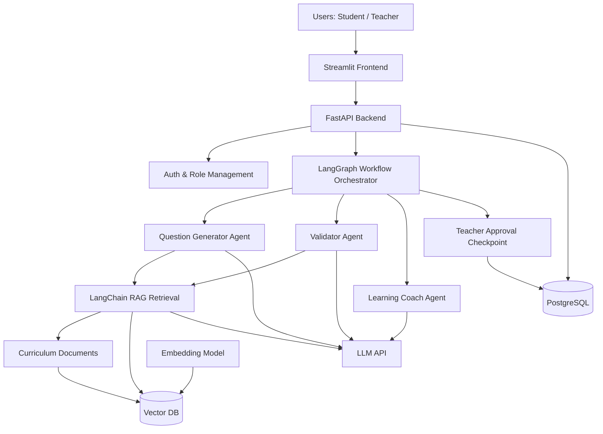
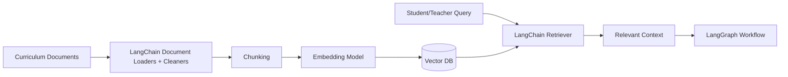
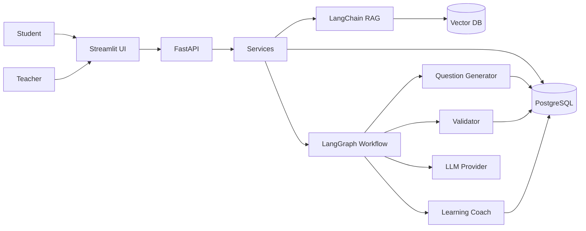

# Capstone Technical Design Document

## 1. Introduction

This capstone project implements an AI-powered personalized learning and examination system for CBSE Class 10 students in Physics and Mathematics. The system is designed to help students generate practice tests, receive feedback, identify weak areas, and receive targeted follow-up questions. Teachers can create, review, and approve curriculum-aligned questions that are later used in assessments.

The design emphasizes a simple, practical MVP that is built using Python and open-source tools. It uses a modular layered architecture so the project remains easy to implement, test, and extend while supporting future growth in curriculum coverage and AI capabilities.

---

## 2. Goals and Scope

### 2.1 Project Goals

- Generate curriculum-grounded examination questions using RAG
- Validate question quality before approval
- Support student self-learning and targeted practice
- Enable teacher review and question bank management
- Track topic-wise performance and improvement
- Build a working MVP within a short capstone timeline

### 2.2 In-Scope Features

- Class 10 Physics and Mathematics
- Chapter and topic structure is discovered from the supplied Physics and Mathematics PDFs during ingestion and persisted as the operational curriculum hierarchy; sample seed rows are development-only and non-authoritative
- MVP question generation for MCQ and numerical questions
- Short answer, long answer, competency-based questions, and teacher review are post-MVP extensions
- Student exam generation and submission
- Weak-topic detection for the MVP; targeted practice generation is a post-MVP extension
- PostgreSQL-backed persistence in local development, testing, and production
- Vector database for retrieval
- Python-based implementation with open-source tools

### 2.3 Out-of-Scope for MVP

- Other classes or boards
- Chemistry or other subjects
- Full mobile app
- Voice/video learning
- Production-scale deployment
- Complex multi-tenant school systems

---

## 3. High-Level Design

The system is structured into five major layers:

1. Presentation Layer
   - Streamlit-based student and teacher interfaces

2. Application Layer
   - FastAPI backend with service modules

3. AI Layer
   - LangChain RAG retrieval and prompt orchestration
- LangGraph workflow orchestration for generation and validation
- Question generator and validator for the MVP; review and learning-coach workflows are post-MVP

4. Data Layer
   - PostgreSQL and vector database

5. External Integration Layer
   - LLM provider and embedding model



---

## 4. Technology Stack

### 4.1 Core Technologies

| Layer | Technology | Rationale |
|---|---|---|
| Frontend | Streamlit | Simple UI development for MVP, quick prototyping |
| Backend | FastAPI | Modern Python API framework with OpenAPI support |
| Language | Python 3.11+ | Best fit for AI, backend, and data processing |
| Agent Framework | LangChain + LangGraph | Best fit for RAG orchestration and agentic workflow state management |
| Database | PostgreSQL | Robust relational data storage |
| Vector DB | FAISS or Chroma | Open-source and lightweight for MVP |
| LLM | OpenAI-compatible API or local open-source model | Easy integration, flexibility |
| Embeddings | sentence-transformers or OpenAI embeddings | Good quality and open-source options |
| Document processing | PyMuPDF, pdfplumber, BeautifulSoup | Open-source parsing for PDFs/text |
| ORM | SQLAlchemy | Clean Python data models and DB integration |
| Validation | Pydantic | Strong validation and schema control |
| Logging | Python logging | Standard, simple, effective |
| Testing | pytest | Lightweight and widely used |

### 4.2 Why LangChain + LangGraph

LangChain is used for:
- retrieval chain construction
- embedding lookup and vector search
- prompt template orchestration
- structured LLM output handling

LangGraph is used for:
- question generation workflow
- validation retry loops
- teacher approval checkpoints
- weak-topic recommendation flow
- personalization cycle

This is appropriate for the capstone because the system is fundamentally a stateful AI workflow rather than a single prompt call.

### 4.2 Open-Source Friendly Defaults

Where possible, the design prefers free or open-source solutions:

- Python + FastAPI + Streamlit
- PostgreSQL
- FAISS or Chroma
- sentence-transformers
- PyMuPDF / pdfplumber
- SQLAlchemy
- pytest
- pydantic

When an external vendor LLM API is used, the design should allow swapping with a local open-source LLM or an alternate API provider later.

---

## 5. Functional Modules

### 5.1 User Management Module

Responsibilities:
- Register student and teacher users
- Store role information
- Manage login sessions and access control

Entities:
- User
- StudentProfile
- TeacherProfile

Key fields:
- user_id
- email
- password_hash
- role
- created_at

---

### 5.2 Curriculum and Content Module

Responsibilities:
- Maintain academic data model
- Store subjects, chapters, topics, and question metadata
- Hold source documents and curriculum references

Entities:
- Subject
- Chapter
- Topic
- CurriculumDocument
- SourceReference

Relationships:
- Each topic belongs to a chapter
- Each chapter belongs to a subject
- Each question references a topic and source content

---

### 5.3 Question Bank Module

Responsibilities:
- Store generated questions
- Track metadata such as difficulty, marks, type, Bloom level, and source references
- Support teacher review and approval

Entity fields:
- question_id
- subject_id
- chapter_id
- topic_id
- class_level
- question_type
- difficulty
- bloom_level
- marks
- question_text
- options
- correct_answer
- expected_answer
- explanation
- learning_objective
- source_reference
- status
- created_by
- created_at

Status values:
- draft
- pending_review
- approved
- rejected

---

### 5.4 Exam and Attempt Module

Responsibilities:
- Create exams based on selected parameters
- Save student answers and evaluation results
- Support score tracking and learning analytics

Entities:
- Exam
- ExamQuestion
- StudentAttempt
- StudentAnswer
- ResultSummary

Key logic:
- Exam creation uses selected subject, chapter, topic, difficulty, and count
- Exam questions are selected from approved questions or newly generated questions
- StudentAttempt stores time spent and completion status
- Feedback and score are computed after submission

---

### 5.5 Analytics and Personalization Module

Responsibilities:
- Compute chapter/topic performance
- Detect weak areas
- Recommend targeted practice
- Track learning improvements over time

Entities:
- TopicPerformance
- StudentProgress
- Badge

Analytics flow:
1. Student submits an exam
2. System calculates performance per topic
3. Weak topics are identified
4. Learning coach suggests new question mix
5. Targeted practice is generated using RAG and relevant topic references

---

### 5.6 Teacher Workflow Module

Responsibilities:
- Generate question sets based on teacher selection
- Review AI-generated questions
- Approve or reject questions
- Create and assign examinations
- View student progress

Core actions:
- generate_question_set()
- review_question()
- approve_question()
- reject_question()
- create_exam()
- assign_exam()
- view_student_performance()

---

## 6. Detailed System Design

### 6.1 Presentation Layer

#### Frontend Components

Student UI:
- Subject selection
- Chapter/topic selection
- Difficulty and question-type selection
- Practice exam creation
- Exam attempt and submission
- Personal progress dashboard
- Weak-area recommendations

Teacher UI:
- Question generation controls
- Review queue
- Approve/reject action
- Question bank management
- Examination assignment interface
- Performance dashboard

#### Implementation Notes

- Use Streamlit because it is quick for capstone delivery
- Keep state simple via session state, server-side persistence, and clean API calls
- Separate role-based pages or sections for student and teacher

---

### 6.2 API Layer Design

FastAPI will serve as the application backend. It will expose REST endpoints grouped by feature set.

#### Proposed API Groups

Auth API:
- POST /auth/login
- POST /auth/register
- POST /auth/logout

User API:
- GET /users/{id}
- GET /students/{id}/progress
- GET /teachers/{id}/dashboard

Question API:
- POST /questions/generate
- GET /questions/{id}
- GET /questions/topic/{topic_id}
- POST /questions/review
- POST /questions/approve
- POST /questions/reject

Exam API:
- POST /exams/generate
- GET /exams/{id}
- POST /exams/{id}/submit
- GET /exams/student/{student_id}

Analytics API:
- GET /analytics/student/{id}/performance
- GET /analytics/student/{id}/weak-topics
- POST /analytics/recommend-practice

#### API Design Principles

- Use JSON request/response schemas
- Validate with Pydantic models
- Keep each endpoint focused on a single concern
- Return consistent response structures

---

### 6.3 AI Layer Design

The AI layer is the core of the system and includes three logical agents, coordinated through a LangGraph workflow.

#### 6.3.0 LangGraph Workflow Design

The high-level AI orchestration is managed by LangGraph using state transitions between nodes.

Core graph states:
- initialize_request
- retrieve_curriculum_context
- generate_questions
- validate_questions
- teacher_review
- approve_questions
- update_student_performance
- recommend_targeted_practice
- finalize_response

Graph decision logic:
- If validation passes, move to approval or exam generation
- If validation fails, regenerate question set
- If teacher rejects questions, send them back for revision
- If student performs poorly in a topic, trigger recommendation node

This makes the AI flow explicit, traceable, and easier to explain in the demo.

#### 6.3.1 Question Generator Agent

Input:
- subject
- chapter
- topic
- difficulty
- question_type
- number_of_questions
- marks
- optional bloom_level

Output:
- list of generated question objects
- answer
- explanation
- metadata
- source refs

Implementation pattern:
- Retrieve relevant contextual chunks from vector DB using LangChain retrieval tools
- Construct prompt using curriculum context and selected parameters
- Generate structured JSON response with LangChain output parsers or Pydantic schema validation
- Validate schema before saving

Pseudo flow:

```python
def generate_questions(request: QuestionGenerationRequest) -> list[Question]:
    context = rag_service.retrieve_context(
        subject=request.subject,
        chapter=request.chapter,
        topic=request.topic,
        query=request.topic
    )

    prompt = build_question_generation_prompt(request, context)
    response = llm_client.generate(prompt, response_format="json")
    questions = parse_and_validate_questions(response)
    return questions
```

With LangGraph, this becomes a node inside a workflow graph rather than a standalone script call.

#### 6.3.2 Question Validator Agent

Responsibilities:
- Check for correct answer alignment
- Check if question matches difficulty
- Check if question fits question type
- Check for duplicates
- Check source relevance
- Confirm learning objective match

Validation flow:

```python
def validate_question(question: Question, context: list[str]) -> ValidationResult:
    checks = {
        "curriculum_relevance": evaluate_relevance(question, context),
        "answer_correctness": check_answer(question),
        "difficulty_match": match_difficulty(question),
        "type_match": match_type(question),
        "duplicate_check": detect_duplicate(question),
        "learning_objective_alignment": align_objective(question)
    }
    return ValidationResult(**checks)
```

If validation fails, the LangGraph workflow can route back to the generation node, optionally with a corrective prompt for regeneration.

#### 6.3.3 Learning Coach Agent

Responsibilities:
- Read student topic performance
- Determine weak and strong areas
- Recommend next practice focus
- Generate targeted practice request

Sample logic:
- If score on a topic is below threshold, mark topic as weak
- Recommend 5 practice questions with a specific mix of conceptual and numerical questions
- Use the same RAG generation flow for the next assessment

---

### 6.4 RAG Module Design

The RAG module is central to the curriculum grounding design and is implemented using LangChain.

#### Components

- Document ingestion
- Text cleaning and chunking
- Embedding generation
- Vector storage
- Retrieval on query
- Prompt assembly for the LLM

#### Flow



#### Suggested Libraries

- PyMuPDF or pdfplumber for PDFs
- BeautifulSoup for HTML content if needed
- sentence-transformers for embeddings
- FAISS or Chroma for vector storage
- langchain, langchain-community, langgraph

#### Retrieval Strategy

- Query by subject + chapter + topic
- Search top-k relevant chunks
- Rank by semantic similarity
- Pass the top chunks into the generation prompt
- Use the same retrieval layer for validation and coaching prompts

---

## 7. Data Model Design

### 7.1 Relational Data Model

#### User
- id
- email
- password_hash
- role
- created_at

#### Student
- id
- user_id
- full_name
- class_level

#### Teacher
- id
- user_id
- full_name
- department

#### Subject
- id
- name

#### Chapter
- id
- subject_id
- name

#### Topic
- id
- chapter_id
- name

#### Question
- id
- subject_id
- chapter_id
- topic_id
- question_type
- difficulty
- bloom_level
- marks
- question_text
- options
- correct_answer
- expected_answer
- explanation
- learning_objective
- source_reference
- status
- created_by
- created_at

#### Exam
- id
- title
- subject_id
- created_by
- created_at

#### ExamQuestion
- id
- exam_id
- question_id
- sequence_no

#### StudentAttempt
- id
- student_id
- exam_id
- score
- status
- start_time
- end_time

#### StudentAnswer
- id
- attempt_id
- question_id
- selected_answer
- is_correct
- score_awarded

#### TopicPerformance
- id
- student_id
- topic_id
- attempts
- correct_answers
- score_percentage
- last_updated

#### Badge
- id
- student_id
- name
- earned_at

---

### 7.2 Data Access Strategy

Use SQLAlchemy ORM with Alembic for migration management.

Recommended structure:

```text
app/
  api/
  core/
  db/
    models/
    repositories/
    migrations/
  services/
  agents/
  rag/
  schemas/
```

---

## 8. Business Logic Design

### 8.1 Question Generation Workflow

1. User selects options
2. System validates inputs
3. RAG service retrieves relevant curriculum context
4. Generator agent creates structured questions
5. Validator agent checks quality
6. Questions are stored as draft or pending_review
7. Teacher reviews and approves them
8. Approved questions enter the question bank

### 8.2 Student Assessment Workflow

1. Student selects exam preferences
2. System retrieves approved questions
3. Exam is generated and displayed
4. Student attempts the exam
5. System evaluates answers
6. Score and explanations are shown
7. Topic performance is updated
8. Weak-area recommendations are generated

### 8.3 Targeted Practice Workflow

1. System computes weak topics from analytics
2. Learning Coach recommends next practice topics
3. LangGraph triggers the recommendation state and calls the retrieval layer
4. RAG queries related curriculum content
5. New exam is generated with topic-specific focus
6. Student gets refined evaluation and feedback

This workflow is especially well suited to LangGraph because it involves iterative decision-making and branching based on performance results.

---

## 9. Security Design

### 9.1 Access Control

- Student and teacher roles must be separate
- Teacher-only endpoints must enforce authorization
- Student endpoints must prevent access to other students’ data
- Use secure password hashing with bcrypt or Argon2

### 9.2 API Security

- Use FastAPI authentication and JWT/OAuth style patterns
- Keep API keys in environment variables
- Do not expose LLM keys to the frontend
- Validate all inputs using Pydantic models

### 9.3 Data Protection

- Restrict database access to backend services only
- Store sensitive user data with encryption at rest where practical
- Limit raw logs for personal information

---

## 10. Quality and Evaluation Design

The system should evaluate not only whether generation works, but whether it is educationally useful.

### 10.1 Question Quality Metrics

- Curriculum relevance
- Correct answer validity
- Difficulty accuracy
- Type alignment
- Explanation completeness
- Learning objective match

### 10.2 RAG Quality Metrics

- Retrieval precision
- Grounding quality
- Citation/source usefulness

### 10.3 System Performance Metrics

- time to generate questions
- time to validate questions
- average exam generation latency
- average student response time

### 10.4 Feedback Loop

Use post-exam performance data to tune retrieval and generation quality.

---

## 11. Testing Strategy

### 11.1 Unit Testing

Focus areas:
- question generation schema validation
- validator logic
- analytics calculation
- exam score computation
- auth and access checks

### 11.2 Integration Testing

Test flows:
- teacher generates a question set
- automated validation stores valid questions with status `validated`
- student generates an exam
- student submits answers
- performance metrics update correctly

### 11.3 AI Output Testing

- Validate generated JSON structure
- Check answer correctness for sample math and science questions
- Measure retrieval quality with known curriculum prompts
- Confirm no invalid or out-of-scope outputs enter the question bank

### 11.4 Tools

- pytest
- FastAPI TestClient
- PostgreSQL test database (`capstone_test`) for unit and integration tests

---

## 12. Deployment Design

For the capstone MVP, deployment should stay lightweight.

### 12.1 Recommended Local Deployment

- Streamlit frontend
- FastAPI backend
- PostgreSQL database
- Vector DB service
- LLM provider via API

### 12.2 Containerization

Use Docker to package the app for cloud deployment. Local development runs directly in a Python virtual environment with PostgreSQL installed locally.

Suggested container layout:
- app/frontend
- app/backend
- app/db
- app/vector-db

### 12.3 Environment Configuration

Use environment variables for:
- database URL
- secret key
- LLM API key
- vector DB path or host
- app mode

Example variables:
- DATABASE_URL
- SECRET_KEY
- OPENAI_API_KEY
- VECTOR_DB_PATH
- APP_ENV

---

## 13. Directory Structure

```text
capstone-project/
├── app/
│   ├── api/
│   │   ├── endpoints/
│   │   ├── dependencies/
│   │   └── schemas/
│   ├── core/
│   │   ├── config.py
│   │   ├── security.py
│   │   └── logging.py
│   ├── db/
│   │   ├── models/
│   │   ├── repositories/
│   │   ├── session.py
│   │   └── migrations/
│   ├── services/
│   │   ├── auth_service.py
│   │   ├── question_service.py
│   │   ├── exam_service.py
│   │   ├── analytics_service.py
│   │   └── rag_service.py
│   ├── agents/
│   │   ├── question_generator.py
│   │   ├── validator.py
│   │   └── learning_coach.py
│   ├── graph/
│   │   ├── workflow.py
│   │   ├── state.py
│   │   └── nodes.py
│   ├── rag/
│   │   ├── ingestion.py
│   │   ├── chunking.py
│   │   ├── embeddings.py
│   │   └── retrieval.py
│   └── main.py
├── frontend/
│   └── streamlit_app.py
├── tests/
│   ├── test_questions.py
│   ├── test_exams.py
│   └── test_analytics.py
├── data/
│   └── curriculum/
├── requirements.txt
├── docker-compose.yml
├── README.md
└── .env.example
```

---

## 14. Component Interaction Diagram



---

## 15. Design Trade-offs

### Why this design works for the MVP

- Streamlit is simple and fast for proof-of-concept interfaces
- FastAPI supports structured APIs and clean integration with Python data models
- PostgreSQL provides reliable relational persistence
- FAISS or Chroma keeps vector search lightweight
- RAG reduces hallucination and increases educational relevance
- Modular service design keeps future enhancements manageable

### Trade-offs accepted

- Not yet microservice-based
- Simple role management rather than enterprise-grade IAM
- Limited advanced AI orchestration in the MVP
- Basic analytics rather than a sophisticated recommender engine

---

## 16. Risk Assessment

### Risk 1: Low-quality questions from LLM
Mitigation:
- Use RAG grounding
- Use validation agent
- Require teacher review for question bank entries

### Risk 2: Retrieval noise from curriculum data
Mitigation:
- Use curated content only
- Chunk documents carefully
- Filter by subject, chapter, and topic

### Risk 3: Weak student personalization logic
Mitigation:
- Track performance at topic level
- Set thresholds for weak areas
- Keep coaching logic transparent and explainable

### Risk 4: Time constraints during capstone delivery
Mitigation:
- Limit scope to essential flows
- Focus on working MVP instead of advanced features
- Keep design modular for future iterations

---

## 17. Future Enhancements

The technical design is intentionally open to future improvements:

- Add more chapters and subjects
- Integrate stronger open-source LLMs locally
- Add asynchronous AI task processing
- Improve long-answer scoring with rubric-based logic
- Add parent/teacher dashboards
- Introduce mobile app support
- Improve deployment to cloud environments

---

## 18. Conclusion

This technical design provides a practical, open-source-friendly blueprint for the capstone MVP. It balances simplicity with correctness, ensuring that the system remains easy to build within the project timeline while still demonstrating the full AI learning loop: curriculum grounding, question generation, validation, exam evaluation, weak-topic analysis, and personalized follow-up practice.

The design is intentionally modular, making it suitable for iterative improvement as the project evolves beyond the MVP stage.
